# Homologação utilizando o site como referência

## 1. Introdução

&emsp;&emsp; O objetivo dessa seção é trazer uma validação, ou seja, uma confirmação acerca dos artefatos que foram produzidos e verificados até o momento. Essas validações serão feitas por usuários do aplicativo que estão sendo expostos de alguma forma com os artefatos que foram elaborados pelo grupo e também pela empresa responsável pela criação do mesmo. Tais validações estão sendo feitas neste artefato sob a visão do própio site como referência:

## 2. Metodologias

&emsp;&emsp; Será utilizada a técnica de validação **Homologação**, que consiste em exposição e testes por partes dos usuários para que os mesmos possam confirmar se o que está sendo construído corresponde com aquilo que se esperava da aplicação.

## 3. Entrando em contato com a empresa responsável

&emsp;&emsp; Foi feita uma tentativa de um contato inicial com a equipe de desenvolvimento/suporte do Google Maps para que possamos tentar validar com os mesmos sobre os artefatos desenvolvidos pelo grupo. Na Figura 1 abaixo está apresentado o email de contato com a equipe, que segue sem respostas até o momento (13/01/23).

<figcaption>Figura 1: Tentativa de contato com a equipe da Google</figcaption>
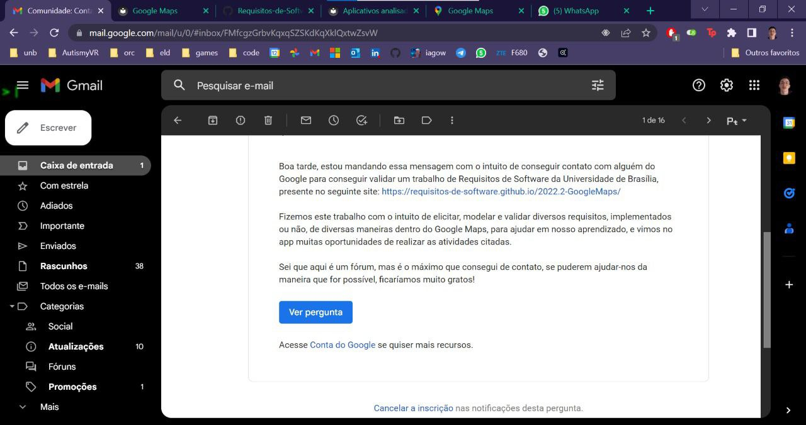{width="800"}
<figcaption>Fonte: Iago Campelo</figcaption>

## 4. Validações informais de artefatos 

&emsp;&emsp; Com objetivo de se extrair dados dos usuários, entramos em contato com diversos grupos de usuários que puderam avaliar os [artefatos](https://requisitos-de-software.github.io/2022.2-GoogleMaps/) em nosso site. Todos estes feedbacks foram coletados entre os dias 11/01/2023 e 15/01/2023 e preservamos o anonimato daqueles que não tinham interesse de que seus nomes fossem divulgados na coleta dos dados. Nas figuras 2 até a 11 veremos um pouco mais dos feedbacks dados acerca do trabalho do grupo e na tabela 1 veremos com um pouco mais de detalhes acerca das sugestões dadas pelos usuários.

### 4.1 Feedback 1

<figcaption>Figura 2: Email encaminhado pela equipe de jornalismo do portal jota</figcaption>
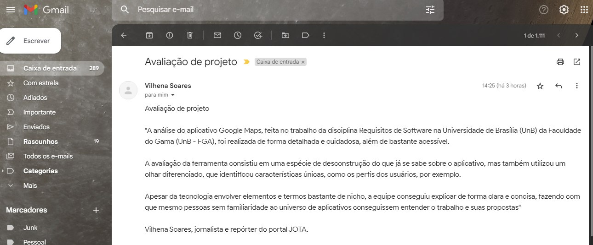{width="800"}
<figcaption>Fonte: Lucas Felipe</figcaption>

### 4.2 Feedback 2

<figcaption>Figura 3: Email encaminhado por um primeiro usuário anônimo</figcaption>
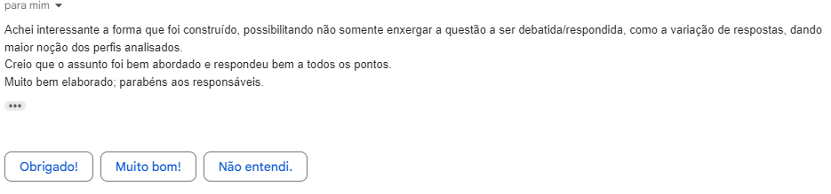{width="800"}
<figcaption>Fonte: Lucas Felipe</figcaption>

### 4.3 Feedback 3

<figcaption>Figura 4: Email encaminhado por um segundo usuário anônimo</figcaption>
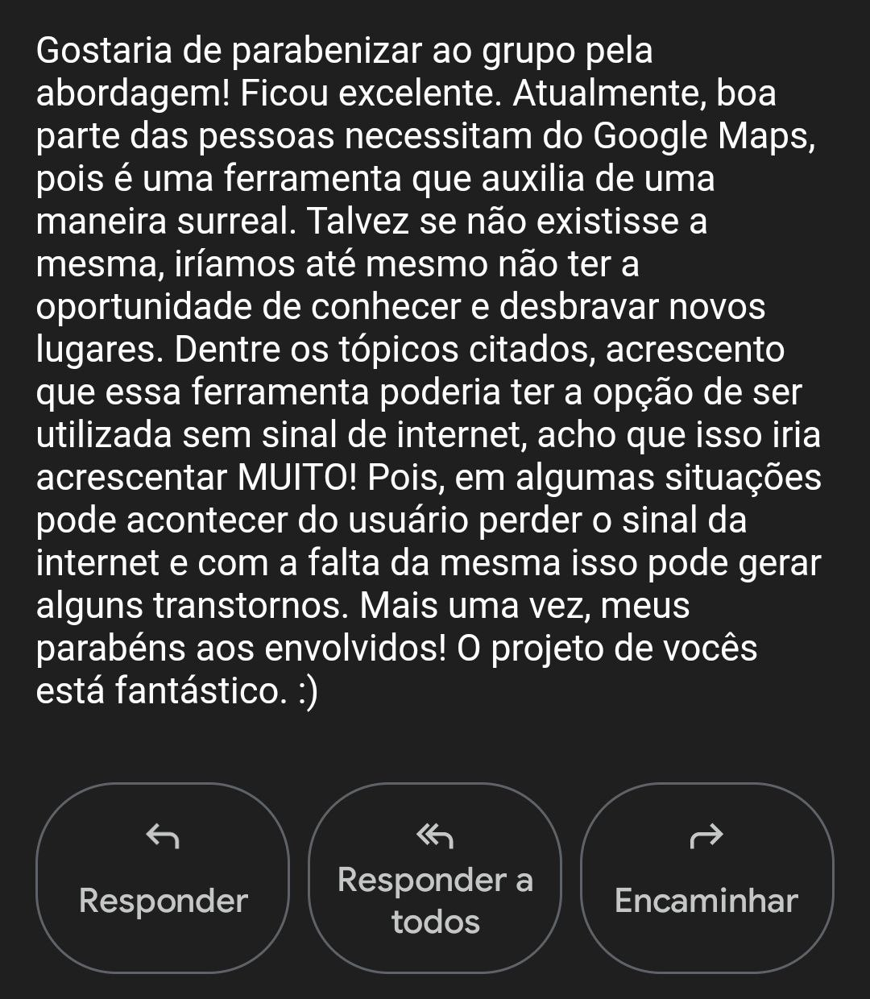{width="800"}
<figcaption>Fonte: Lucas Felipe</figcaption>

### 4.4 Feedback 4

<figcaption>Figura 5: Email encaminhado por um terceiro usuário anônimo</figcaption>
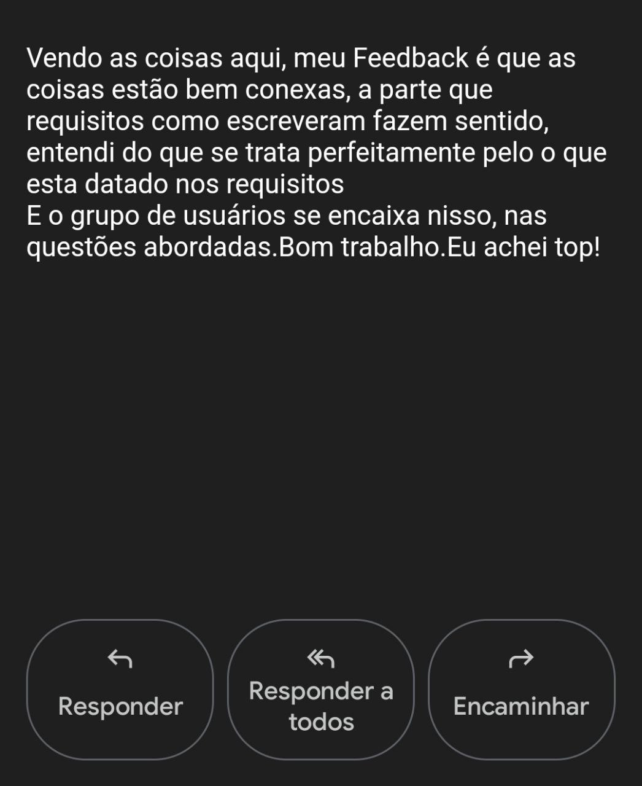{width="800"}
<figcaption>Fonte: Lucas Felipe</figcaption>

### 4.5 Feedback 5

<figcaption>Figura 6: Email encaminhado por um quarto usuário anônimo</figcaption>
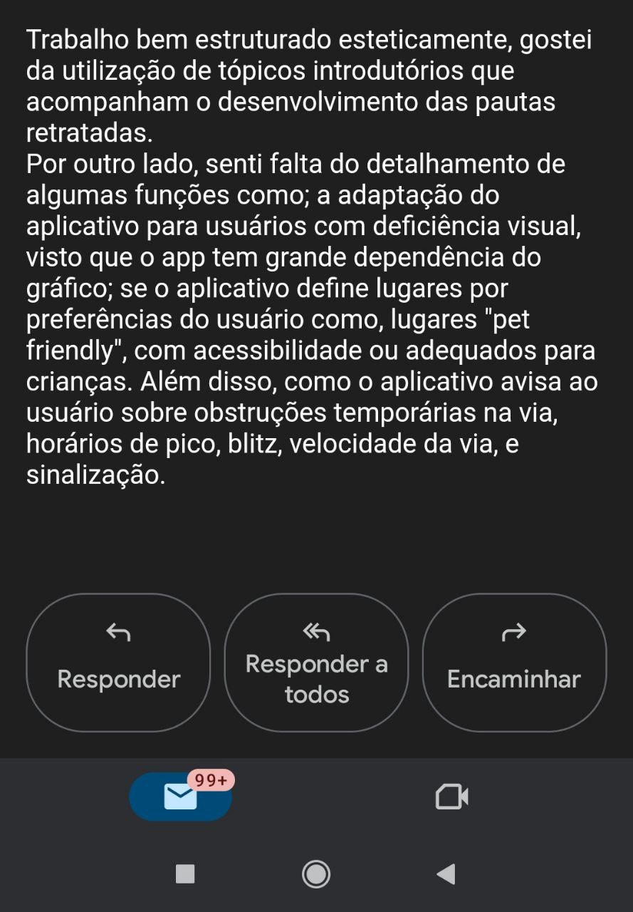{width="800"}
<figcaption>Fonte: Lucas Felipe</figcaption>

### 4.6 Feedback 6

<figcaption>Figura 7: Email encaminhado por um quinto usuário anônimo</figcaption>
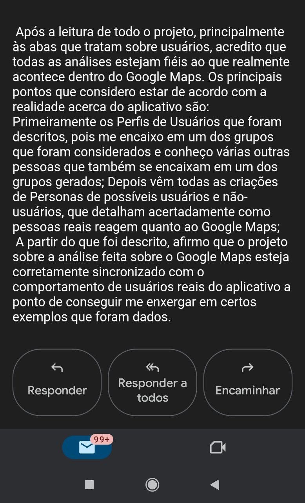{width="800"}
<figcaption>Fonte: Lucas Felipe</figcaption>

### 4.7 Feedback 7

<figcaption>Figura 8: Email encaminhado por um sexto usuário anônimo</figcaption>
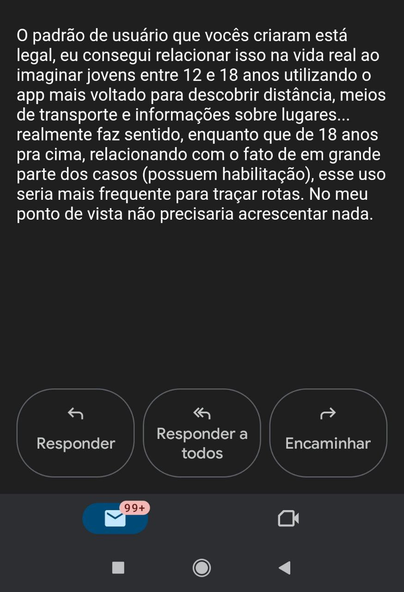{width="800"}
<figcaption>Fonte: Lucas Felipe</figcaption>

### 4.8 Feedback 8

<figcaption>Figura 9: Email encaminhado por um sétimo usuário anônimo</figcaption>
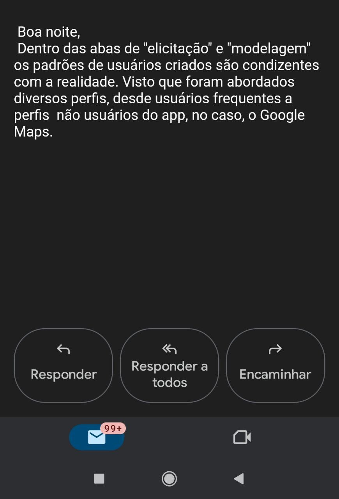{width="800"}
<figcaption>Fonte: Lucas Felipe</figcaption>

### 4.9 Feedback 9

<figcaption>Figura 10: Email encaminhado por um oitavo usuário anônimo</figcaption>
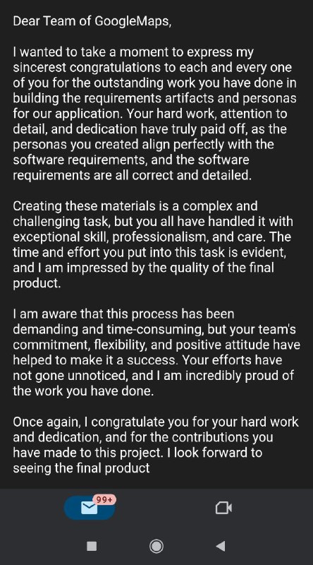{width="800"}
<figcaption>Fonte: Lucas Felipe</figcaption>

### 4.10 Feedback 10

<figcaption>Figura 11: Email encaminhado por um nono usuário anônimo</figcaption>
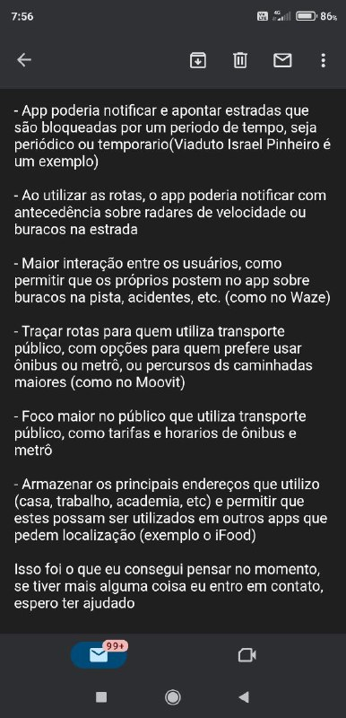{width="800"}
<figcaption>Fonte: Lucas Felipe</figcaption>

### 4.11 Feedback 11

<figcaption>Figura 11: Email encaminhado por um décimo usuário anônimo</figcaption>
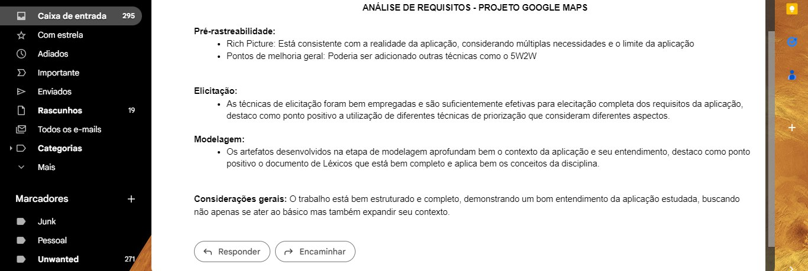{width="800"}
<figcaption>Fonte: Lucas Felipe</figcaption>

## 5. Conclusão

&emsp;&emsp; De uma forma geral o grupo recebeu uma série de feedbacks positivos em relação a execução do projeto, comprovando todo o desempenho e qualidade acerca do desenvolvimento do projeto. Entretanto, veremos na tabela 1 abaixo alguns feedbacks de melhorias propostas pelos usuários até então:

<figcaption>Tabela 1: Sugestões de melhorias</figcaption>

 |      Seção      |                      Tipos de Sugestão                      |                                                                    Sugestões                                                                     |
 | :-------------: | :---------------------------------------------------------: | :----------------------------------------------------------------------------------------------------------------------------------------------: |
 |   Feedback 3    |               Funcionalidade não implementada               |                                               Utilização da ferramenta sem necessitar de internet.                                               |  |
 |   Feedback 5    |                       Acessibilidade                        |                                             Como o aplicativo auxilia pessoas com deficiência visual                                             |  |
 |   Feedback 5    |       Filtragem de locais por preferência de usuário        | Se é possível dentro do aplicativo encontrar descrições para locais que permitem acesso a animais, locais recomendados para ocasiões específicas |  |
 | Feedback 5 e 10 |                 Informações acerca da rota                  |          Se é possível obter informações acerca de obstrução de vias, acidentes, buracos e radares como outros aplicativos de trânsito.          |  |
 |   Feedback 10   |          Informações acerca de meios de transporte          |                             Se é possível obter informações acerca de transportes públicos, como valores e horários.                             |  |
 |   Feedback 10   | Fixar locais e poder relacionar eles com outros aplicativos |                              Se é possível fixar locais favoritos e compartilhar esses dados com outros aplicativos                              |  |

<figcaption>Fonte: Lucas Felipe </figcaption>

&emsp;&emsp; Uma ressalva importante é que algumas destas funcionalidades já existem dentro da aplicação e não foram encontradas por usuários, sendo assim um problema de relacionado com outro campo de estudo denominado "**Interação humano computador**".

## 6. Histórico de versão

|    Data    | Versão |                          Modificações                          | Autor(es) | Revisor(es) |
| :--------: | :----: | :------------------------------------------------------------: | :-------: | :---------: |
| 12/01/2023 |  1.0   |                          Homologação                           |   Lucas   |   Luciano   |
| 13/01/2023 |  1.1   | Criação da tabela de melhorias e adicionando até o Feedback 11 |   Lucas   |   Luciano   |
| 19/01/2023 |  1.1   | Retira os termos de baixo nível e exclui o arquivo onde seria elaborado a prototipação |   Lucas   |   Iago   |

## 7. Bibliografia

> SERRANO, Milene; SERRANO, Mauricio. Requisitos – Aula 17. 2019. Disponível em: [link](https://aprender3.unb.br/pluginfile.php/2307541/mod_resource/content/1/Requisitos%20-%20Aula%20019a.pdf) Acesso em: 12 jan. 2023

> SERRANO, Milene; SERRANO, Mauricio. Requisitos – Aula 20. 2019. Disponível em: [link](https://aprender3.unb.br/pluginfile.php/2307566/mod_resource/content/2/Requisitos%20-%20Aula%20023.pdf) Acesso em: 12 jan. 2023

