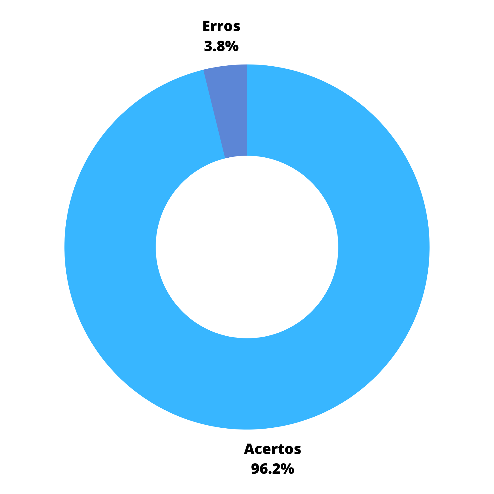

# Planejamento

##  1. Introdução

&emsp; O planejamento de uma equipe é uma das parte mais importantes para o projeto, é onde os elementos que devem ser produzidos são elencados para cada pessoa e é determinado o período de realização das atividades. Para poder verificar o planejamento do grupo 5 - Google Maps deve ser levado em conta os artefatos: [cronograma realizado e planejado](../../planejamento/1.cronograma.md), [metodologias](../../planejamento/2.metodologias.md), [ferramentas](../../planejamento/3.ferramentas.md), [padronização](../../planejamento/4.padronizacao.md) e os artefatos da [pre-rastreabilidade](../../pre_rastreabilidade/RichPicture.md).

## 2. Metodologia

&emsp; Os artefatos foram analisados de acordo com uma tabela baseada na tabela do plano de ensino da matéria de requisitos como pode ser vista na tabela 1 abaixo:

<figcaption align="center">Tabela 1: Modelo</figcaption>

|       Código       | 
Item
 |     Total      |          Sim          |         Não         | Ocorrência de Erros  |
| :----------------: | :---------------------------------: | :------------: | :-------------------: | :-----------------: | :------------------: |
| Código do critério |      Critério a ser analisado       | Total de itens | Quantidade de acertos | Quantidade de erros | Porcentagem de erros |

<figcaption align="center">Fonte: Alexia</figcaption>

&emsp; Nos resultados será colocado os gráficos demonstrando visualmente a quantidade de erros e acertos pela quantidade de critérios no formato de porcentagem.

## 3. Verificação

&emsp;

<figcaption align="center">Tabela 2: Planejamento</figcaption>

| Código |                                                      
Item
                                                      | Total |  Sim  |  Não  | Ocorrência de Erros |
| :----- | :-------------------------------------------------------------------------------------------------------------------------------------------: | :---: | :---: | :---: | :-----------------: |
| 1      |                                                      O histórico de versão padronizado?                                                       |   6   |   6   |   0   |        0.00%        |
| 2      |                                             O(s) autor(es) e o(s) revisor(es) para cada artefato?                                             |  22   |  22   |   0   |        0.00%        |
| 3      |             [A motivação e os critérios](../../pre_rastreabilidade/RichPicture.md#2-aplicativo-escolhido) para a escolha do App?              |   1   |   1   |   0   |        0.00%        |
| 4      |                               [Vídeo de apresentação](../../entregas) na categoria “não listado” no YouTube?                               |   1   |   1   |   0   |        0.00%        |
| 5      |                                      Referências bibliográficas e/ou bibliografia em todos os artefatos?                                      |   6   |   6   |   0   |        0.00%        |
| 6      |                                As tabelas e imagens possuem legenda e fonte e elas chamadas dentro dos texto?                                 |  26   |  25   |   1   |        3.85%        |
| 7      |                                 Um texto fazendo uma introdução dos artefatos, por exemplo das “Ferramentas”?                                 |  26   |  25   |   1   |        3.85%        |
| 8      |                             Uma página apresentando os integrantes da equipe (com foto) com nome e sem matrícula?                             |  16   |  16   |   0   |        0.00%        |
| 9      |                           O cronograma do planejamento apresenta todas as atividades de todas as etapas para cada.                            |  16   |  16   |   0   |        0.00%        |
| 10     |                      integrante com as datas de início e fim das entrega dos artefatos e com o período da revisão deles?                      |  16   |  16   |   0   |        0.00%        |
| 11     |                         O cronograma do planejamento apresenta um período de gravação da apresentação de cada etapa.                          |  16   |  16   |   0   |        0.00%        |
| 12     | O cronograma executado com quem realizou cada artefato/atividade com as datas de início e fim da construção/realização do artefato/atividade. |  16   |  16   |   0   |        0.00%        |
| 13     |              Ata(s) da(s) reuniões (com data, horário de início e do final, participantes, objetivo, atividades definidas etc).               |   6   |   6   |   0   |        0.00%        |
| 14     |                                                        A gravação da reunião do grupo.                                                        |   6   |   6   |   0   |        0.00%        |
| 15     |                         No artefato “Rich Picture” possui uma legenda explicando os símbolos utilizados no diagrama?                          |   1   |   1   |   0   |        0.00%        |
| 16     |               Todos os 5 componentes de um “Rich Picture” estão presentes no artefato do “Rich Picture” apresentado pelo grupo.               |   1   |   1   |   0   |        0.00%        |

<figcaption align="center">Fonte: Alexia</figcaption>

&emsp; Na tabela 3 é possível ver o tipo de erro e os pontos a serem ajustados de acordo com o que falta, facilitando o processo de correção de quem fez o artefato.

<figcaption>Tabela 3: Erros encontrados e pontos a ajustar - Planejamento</figcaption>
| Código |   Tipos de erro    |              Pontos a serem ajustados               |
| :----: | :----------------: | :-------------------------------------------------: |
|   6    | Sem texto chamando | Falta um texto para chamar a tabela 8 em cronograma |
|   7    |   Sem introdução   | Falta um texto para chamar a tabela 8 em cronograma |

<figcaption>Fonte: Alexia</figcaption>

## 4. Resultados

&emsp; Poucas alterações foram encontradas para serem corrigidas, além dos checklists há alguns pontos importantes a serem observados: algumas páginas como cronograma, ferramentas e apresentações não há bibliografias porém não se consta necessidade de bibliografia em tais artefatos. Na figura 1 é possível ver o gráfico que representa os itens de código 6 e 7 que obtiveram 1 erro de 26 artefatos.

<figcaption>Figura 1: Porcentagem de erros</figcaption>
{width="400" height="400"}
<figcaption>Fonte: Alexia</figcaption>

## 5. Histórico de versão

| Data       | Versão | Modificações                       | Autor(es) | Revisor(es) |
| ---------- | ------ | ---------------------------------- | --------- | ----------- |
| 12/01/2023 | 1.0    | Criação da página                  | Alexia    | Marcus      |
| 22/01/2023 | 1.1    | Arruma links para outros artefatos | Luciano   | Lucas       |

## 6. Bibliografia

> FERNANDES, Márcia. Referências bibliográficas ABNT: como fazer? . Toda Matéria, 2022. Disponível em: link. Acesso em: 8 de dez. de 2022.

> Introducing Rich Pictures, CTEC2402 - Software Development Project. Acesso em nov. de 2022.
