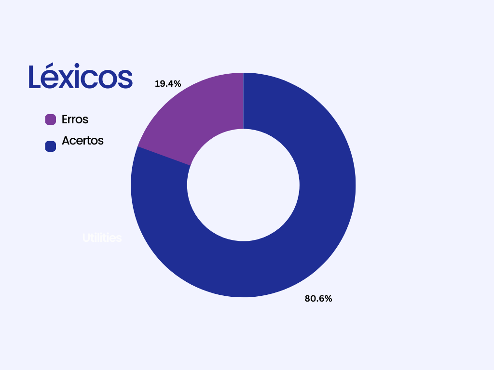
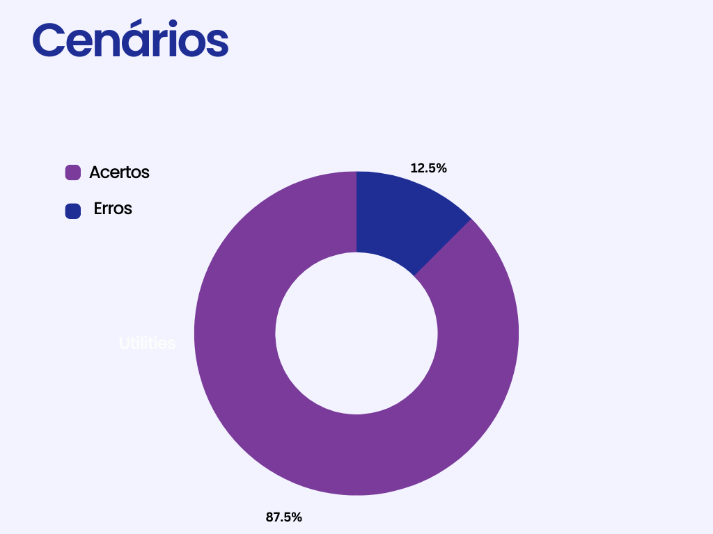
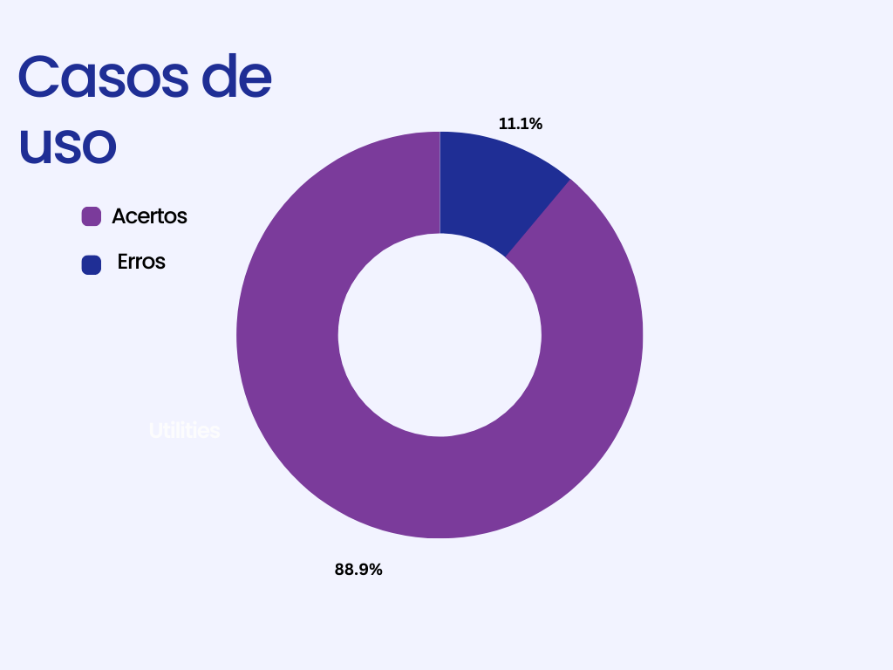
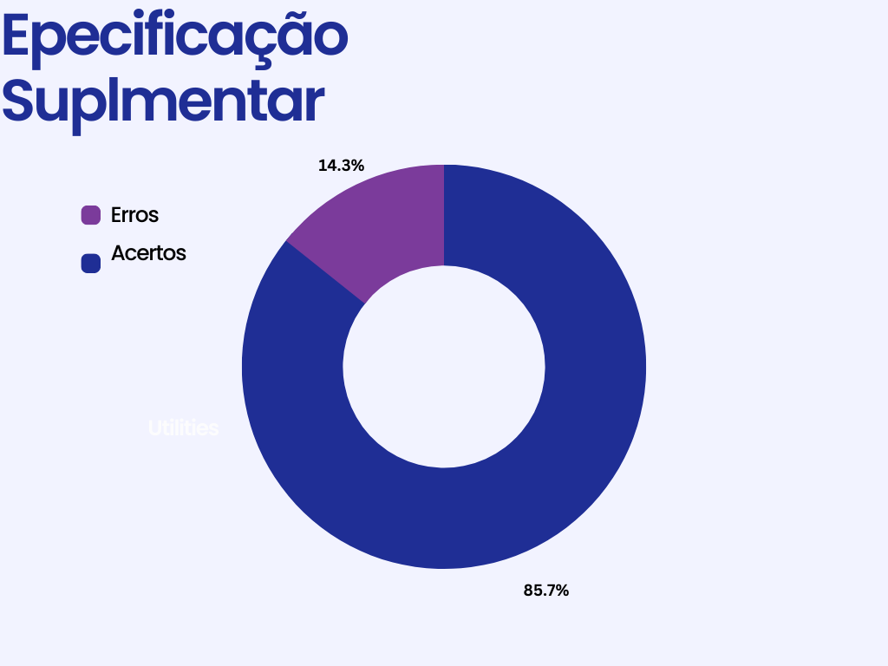

# Cenários, Léxico, Caso de Uso, Especificação Suplementar

## 1. Introdução

&emsp;&emsp; Documento criado para a **inspeção** dos artefatos de modelagem  (Cenários, Léxico, Caso de Uso, Especificação Suplementar) desenvolvidos na aba de  [modelagem](https://requisitos-de-software.github.io/2022.2-GoogleMaps/modelagem/1.lexicos/). Todos estes artefatos estão sendo avaliados de acordo com as versões elaboradas até o dia 12/01/2023.

## 2. Léxicos

&emsp;&emsp;Foi decidido que a inspeção dos Léxicos fosse o primeiro artefato a ser verificado apenas para manter a ordem de entrega. Os artefatos foram avaliados com base nos critérios disponibilizados pelo professor no plano de ensino e na verificação feita pelo grupo 4 sobre o nosso trabalho. Na tabela 1 e 2 abaixo veremos um pouco mais detalhadamente a verificação do artefato **Léxicos**. E posteriormente na figura 1, veremos em formato de gráfico como se deram as propagações de erros em relação ao todo analisado.

<figcaption>Tabela 1: Tabela de defeitos do artefato de "Léxicos"</figcaption>

| Código |                    
Item
                    | Total | Sim | Não | Ocorrência de Erros |
|:------:|:-------------------------------------------------------------------------:|:-----:|:---:|:---:|:-------------------:|
|   1    |                      Histórico de versão padronizado                      |   1   |  1  |  0  |        0.00%        |
|   2    |                 Há autores e revisores para cada artefato                 |   1   |  1  |  0  |        0.00%        |
|   3    |                       Há referências bibliográficas                       |   1   |  1  |  0  |        0.00%        |
|   4    |                      Texto de introdução no artefato                      |   1   |  1  |  0  |        0.00%        |
|   5    | As tabelas e/ou imagens possuem legenda, fonte e chamadas dentro do texto |   1   |  1  |  0  |        0.00%        |
|   6    |                    Há definição do usuário nos Léxicos                    |   1   |  0  |  1  |       100.00%       |
|   7    |                   Os léxicos estão em ordem alfabética                    |  15   | 15  |  0  |        0.00%        |
|   8    |                   Os léxicos possuem ligações entre si                    |   1   |  1  |  0  |        0.00%        |
|   9    |   Os léxicos utilizam a estrutura de dicionário (verbo, objeto, estado)   |  15   | 15  |  0  |        0.00%        |
|   10   |                 Os léxicos fazem conexão com os cenários                  |  15   | 15  |  0  |        0.00%        |
|   11   |           Os léxicos são utilizados dentro dos outros artefatos           |  15   |  3  | 12  |       80.00%        |

<figcaption>Fonte: Luíza Esteves e Iago Campelo</figcaption>

<figcaption>Tabela 2: Erros encontrados e pontos a ajustar - Léxicos</figcaption>

| Código |   Tipos de erro   |                                      Pontos a serem ajustados                                      |
|:------:|:-----------------:|:--------------------------------------------------------------------------------------------------:|
|   6    | Léxico incompleto |                         Deve-se acrescentar o léxico de usuário no artefato                         |
|   11   | Léxicos sem links | Dentro dos outros artefatos, os léxicos devem ser referenciados com link facilitando o entendimento |

<figcaption>Fonte: Luíza Esteves</figcaption>

<figcaption>Figura 1: Gráficos de defeitos de Léxicos</figcaption>
{width="400"}
<figcaption>Fonte: Luíza Esteves</figcaption>

## 3. Cenários
&emsp;&emsp;Os artefatos foram avaliados com base nos critérios disponibilizados pelo professor no plano de ensino e na verificação feita pelo grupo 4 sobre o nosso trabalho. Na tabela 3 e 4 abaixo veremos um pouco mais detalhadamente a verificação do artefato **Cenários**. E posteriormente na figura 2, veremos em formato de gráfico como se deram as propagações de erros em relação ao todo analisado.

<figcaption>Tabela 3: Tabela de defeitos do artefato de "Cenários"</figcaption>

| Código |           
Item
            | Total | Sim | Não | Ocorrência de Erros |
|:------:|:--------------------------------------------------------:|:-----:|:---:|:---:|:-------------------:|
|   1    |            Todos os cenários possuem títulos?            |  12   | 12  |  0  |        0.00%        |
|   2    |      Todos os cenários possuem todos os elementos?       |  12   | 12  |  0  |        0.00%        |
|   3    |         O objetivo de todos os cenários é claro?         |  12   | 12  |  0  |        0.00%        |
|   4    | Os contextos foram bem definidos? (local e pré-condição) |  12   |  0  | 12  |       100.00%       |
|   5    |    Todos os recursos fazem sentido e são necessários?    |  12   | 12  |  0  |        0.00%        |
|   6    |         A exceção é condizente com a realidade?          |  12   | 12  |  0  |        0.00%        |
|   7    |             Os episódios são bem descritos?              |  12   | 12  |  0  |        0.00%        |
|   8    |       Os cenários fazem sentido com os requisitos?       |  12   | 12  |  0  |        0.00%        |

<figcaption>Fonte: Iago Campelo</figcaption>

<figcaption>Tabela 6: Erros encontrados e pontos a ajustar - Cenários</figcaption>

| Código | Tipos de erro |   Pontos a serem ajustados   |
|:------:|:-------------:|:----------------------------:|
|   4    |   Ausência    | Adicionar local nos cenários |

<figcaption>Fonte: Iago Campelo</figcaption>

<figcaption>Figura 2: Gráficos de defeitos de Cenários</figcaption>

{width="400"}

<figcaption>Fonte: Iago Campelo</figcaption>

## 4. Casos de Uso
&emsp;&emsp;Os artefatos foram avaliados com base nos critérios disponibilizados pelo professor no plano de ensino e na verificação feita pelo grupo 4 sobre o nosso trabalho. Na tabela 5 e 6 abaixo veremos um pouco mais detalhadamente a verificação do artefato **Casos de Uso**. E posteriormente na figura 3, veremos em formato de gráfico como se deram as propagações de erros em relação ao todo analisado.

<figcaption>Tabela 5: Tabela de defeitos do artefato de "Casos de Uso"</figcaption>

| Código |           
Item
            | Total | Sim | Não | Ocorrência de Erros |
|:------:|:--------------------------------------------------------:|:-----:|:---:|:---:|:-------------------:|
|   1    |           Os casos de uso estão especificados            |   3   |  3  |  0  |        0.00%        |
|   2    |        Foram especificados os atores principais?         |   3   |  3  |  0  |        0.00%        |
|   3    |    O ator principal está do lado esquerdo do sistema?    |   3   |  3  |  0  |        0.00%        |
|   4    |   Os atores estão fora da caixa de limite do sistema?    |   3   |  3  |  0  |        0.00%        |
|   5    | É apresentado a especificação do diagrama de caso de uso |   3   |  3  |  0  |        0.00%        |
|   6    |            As relações include estão corretas            |   9   |  9  |  0  |        0.00%        |
|   7    |          As relações de extends estão corretas           |  16   | 16  |  0  |        0.00%        |
|   8    |                Apresenta rastreabilidade                 |   3   |  3  |  0  |        0.00%        |
|   9    |     Apresenta legendas para os símbolos utilizados?      |   5   |  5  |  0  |        0.00%        |
|   10   |              Existe algum ator secundário?               |   3   |  0  |  3  |       100.00%       |
|   11   |     Participação da persona ou cliente na validação      |   3   |  0  |  3  |        100.00%      |

<figcaption>Fonte: Iago Campelo</figcaption>

<figcaption>Tabela 6: Erros encontrados e pontos a ajustar - Casos de Uso</figcaption>

| Código |    Tipos de erro    |                       Pontos a serem ajustados                        |
|:------:|:-------------------:|:---------------------------------------------------------------------:|
|   10   |      Ausência       |                     Adicionar atores secundários                      |
|   11   | Falta de informação | Não pode ser percebido se foi feita alguma validação dos casos de uso |

<figcaption>Fonte: Iago Campelo</figcaption>

<figcaption>Figura 3: Gráficos de defeitos de Casos de Uso</figcaption>

{width="400"}

<figcaption>Fonte: Iago Campelo</figcaption>

## 5. Especificação suplementar

&emsp;&emsp;Por último, foi feita a verificação da especificação suplementar, que também se baseou na verificação feita pelo grupo 4. Na tabela 7 e 8 abaixo veremos um pouco mais detalhadamente a verificação do artefato **Especificação suplementar**. E posteriormente na figura 4, veremos em formato de gráfico como se deram as propagações de erros em relação ao todo analisado.

<figcaption>Tabela 7: Tabela de defeitos do artefato de "Especificação suplementar"</figcaption>

| Código |                          
Item
                          | Total | Sim | Não | Ocorrência de Erros |
|:------:|:-------------------------------------------------------------------------------------:|:-----:|:---:|:---:|:-------------------:|
|   1    |                            Histórico de versão padronizado                            |   1   |  1  |  0  |        0.00%        |
|   2    |                       Há autores e revisores para cada artefato                       |   1   |  1  |  0  |        0.00%        |
|   3    |                             Há referências bibliográficas                             |   1   |  1  |  0  |        0.00%        |
|   4    |                            Texto de introdução no artefato                            |   1   |  1  |  0  |        0.00%        |
|   5    |       As tabelas e/ou imagens possuem legenda, fonte e chamadas dentro do texto       |   1   |  1  |  0  |        0.00%        |
|   6    |                           O artefato segue o modelo FURPS+                            |   1   |  1  |  0  |        0.00%        |
|   7    |              O documento especifica o tempo de resposta, no Desempenho?               |   1   |  1  |  0  |        0.00%        |
|   8    |        O documento especifica qual plataforma o aplicativo pode ser executado?        |   1   |  1  |  0  |        0.00%        |
|   9    |                  Todos os requisitos podem ser testados (RF e RNF)?                   |   9   |  9  |  0  |        0.00%        |
|   10   |         O documento fala sobre sobre a Segurança a falhas na Confiabilidade ?         |   1   |  0  |  1  |       100.00%       |
|   11   |                  O documento fala sobre a Satisfação na Usabilidade?                  |   1   |  1  |  0  |        0.00%        |
|   12   |              O documento fala sobre a disponibilidade na Confiabilidade?              |   1   |  1  |  0  |        0.00%        |
|   13   | O documento fala sobre sobre a segurança no armazenamento de dados na confiabilidade? |   1   |  1  |  0  |        0.00%        |
|   14   |                  O documento fala sobre a Satisfação na Usabilidade?                  |   1   |  0  |  1  |       100.00%       |

<figcaption>Fonte: Luíza Esteves e Iago Campelo</figcaption>

<figcaption>Tabela 8: Erros encontrados e pontos a ajustar - Especificação suplementar</figcaption>
| Código |    Tipos de erro    |                     Pontos a serem ajustados                     |
|:------:|:-------------------:|:----------------------------------------------------------------:|
|   10   | Falta de informação | Deve-se acrescentar informações sobre confiança na confiabilidade |
|   14   | Falta de informação |  Deve-se acrescentar informações sobre satisfação na usabilidade  |

<figcaption>Fonte: Luíza Esteves</figcaption>

<figcaption>Figura 4: Gráficos de defeitos da Especificação Suplementar</figcaption>
{width="400"}
<figcaption>Fonte: Luíza Esteves</figcaption>

## 6. Histórico de versão

|    Data    | Versão |                  Modificações                   | Autor(es) | Revisor(es) |
|:----------:|:------:|:-----------------------------------------------:|:---------:|:-----------:|
| 10/01/2023 |  1.0   | Criação do artefato de verificação de modelagem |   Luíza   |   Luciano   |
| 10/01/2023 |  1.1   |     Adição da verificação da especificação      |   Luíza   |   Luciano   |
| 15/01/2023 |  1.2   |     Verificação dos Cenários e Casos de Uso     |   Iago    |   Luciano   |

## 7. Bibliografia

> SERRANO, Milene; SERRANO, Mauricio. Requisitos – Aula 17. 2019. Disponível em: [link](https://aprender3.unb.br/pluginfile.php/2307541/mod_resource/content/1/Requisitos%20-%20Aula%20019a.pdf) Acesso em: 07 jan. 2023

> Projeto de Requisitos - TIKTOK 2022.1. Disponível em: [link](https://requisitos-de-software.github.io/2022.1-TikTok/). Acesso em: 07 jan. 2023

> Projeto de Requisitos - Youtube 2022.1. Disponível em: [link](https://requisitos-de-software.github.io/2022.1-Youtube/). Acesso em: 08 jan. 2023
