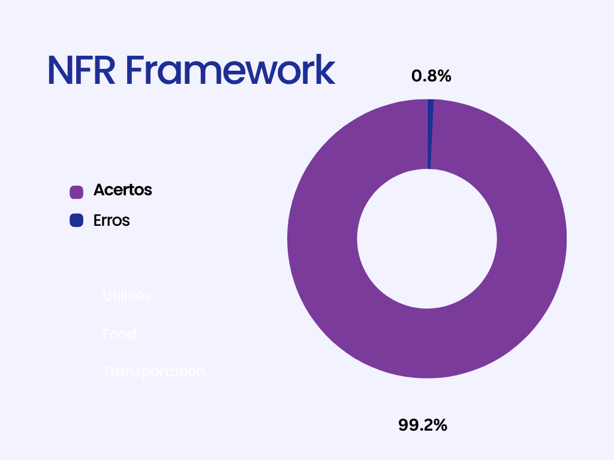
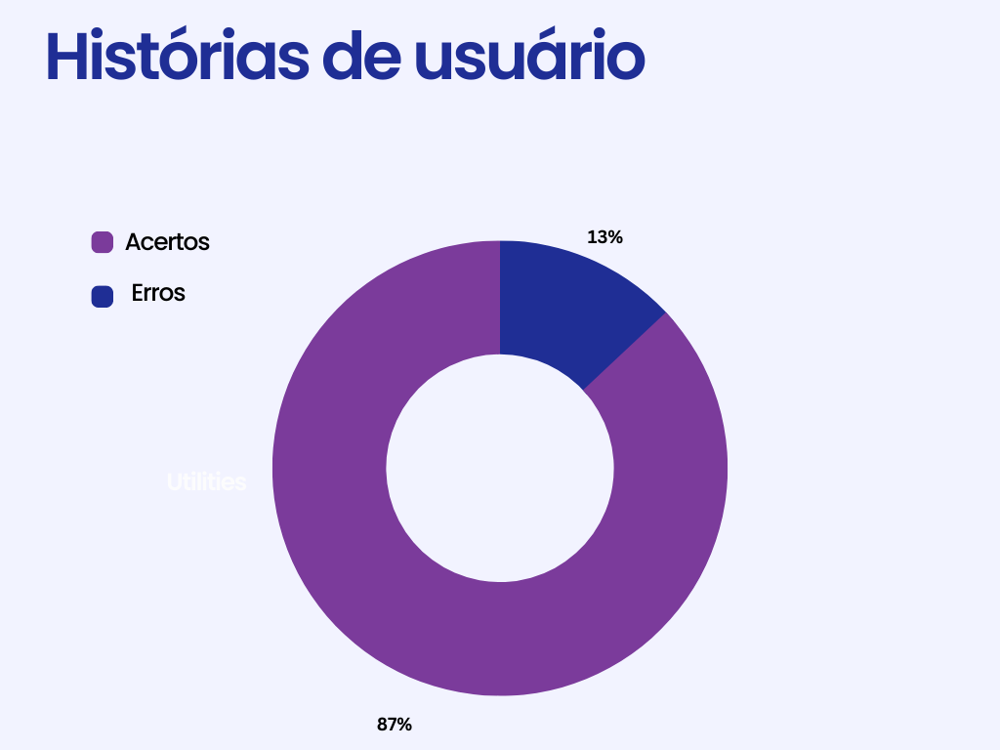
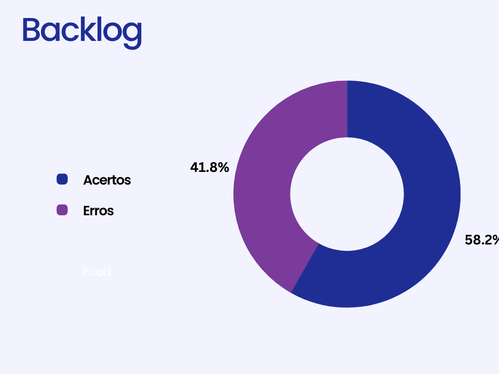

# Histórias de Usuário, Backlogs, NFR Framework

## 1. Introdução

&emsp;&emsp; Documento criado para a **inspeção** dos artefatos de modelagem ágil (Product Backlog, Histórias de usuário e NFR Framework) desenvolvidos na aba de  [modelagem](https://requisitos-de-software.github.io/2022.2-GoogleMaps/modelagem/5.NFR/). Todos estes artefatos estão sendo avaliados de acordo com as versões elaboradas até o dia 10/01/2023.

## 2. NFR Framework

&emsp;&emsp;Foi decidido que a inspeção do NFR Framework fosse o primeiro artefato a ser verificado apenas para manter a ordem de entrega. Na tabela 1 e 2 abaixo veremos um pouco mais detalhadamente a verificação do artefato **NFR Framework**. E posteriormente na figura 1, veremos em formato de gráfico como se deram as propagações de erros em relação ao todo analisado. 

<figcaption>Tabela 1: Tabela de defeitos do artefato de "NFR Framework"</figcaption>

| Código |                 
Item
                  | Total |  Sim  |  Não  | Ocorrência de Erros |
| :----: | :------------------------------------------------------------------: | :---: | :---: | :---: | :-----------------: |
|   1    |                   Histórico de versão padronizado                    |   1   |   1   |   0   |        0.00%        |
|   2    |                     O artefato possui introdução                     |   1   |   1   |   0   |        0.00%        |
|   3    |                Há uma definição clara da metodologia                 |   1   |   0   |   1   |        100%         |
|   4    |            Há uma padronização na construção do artefato             |   1   |   1   |   0   |        0.00%        |
|   5    |                   Os softgoals estão bem definidos                   |   9   |   9   |   0   |        0.00%        |
|   6    |          Os softgoals são decompostos em operacionalizações          |   9   |   9   |   0   |        0.00%        |
|   7    |         Os softgoals representam corretamente os requisitos          |   9   |   9   |   0   |        0.00%        |
|   8    | Os objetivos estão decompostos em uma hierarquia AND/OR de softgoals |  44   |  44   |   0   |        0.00%        |
|   9    |         Os graus de satisfação foram definidos corretamente          |   0   |   0   |   1   |        100%         |
|   10   |                  As setas possuem sentido coerente                   |  64   |  64   |   0   |        0.00%        |
|   11   |    As linhas contínuas e tracejadas foram utilizadas corretamente    |  64   |  64   |   0   |        0.00%        |
|   12   |                            Existem claims                            |  34   |   34   |   0  |        0.00%         |
|   13   |              Impactos contribuem apenas entre softgoals              |   9   |   9   |   0   |        0.00%        |
|   14   |         Os elementos dos diagramas estão bem representados?          |   1   |   1   |   0   |        0.00%        |
|   15   |      Existem legendas para cada símbolo utilizado nos diagramas      |  12   |  12   |   0   |        0.00%        |
|   16   |       O artefato está representando corretamente os requisitos       |   1   |   1   |   0   |        0.00%        |

<figcaption>Fonte: Lucas Felipe e Luciano Freitas</figcaption>

<figcaption>Tabela 2: Erros encontrados e pontos a ajustar - NFR Framework</figcaption>
| Código |                           Tipos de erro                            |                           Pontos a serem ajustados                            |
| :----: | :----------------------------------------------------------------: | :---------------------------------------------------------------------------: |
|   3    |                          Texto incompleto                          |         A metodologia do NFR Framework não está explicada no artefato         |
|   9    | Não há nenhum tópico que demonstre o grau de satisfação do usuário | Criação de algum artefato que traga esses índices de satisfação dos usuários. |
|   12   |                         Defeito de omissão                         |    É relevante adicionar as claims para apoiar ou negar as justificativas     |

<figcaption>Fonte: Lucas Felipe</figcaption>

<figcaption>Figura 1: Gráficos de defeitos de NFR Framework</figcaption>
{width="400"}
<figcaption>Fonte: Lucas Felipe</figcaption>

## 3. Histórias de usuário

&emsp;&emsp;Foi decidido que a inspeção das histórias de usuário fosse o segundo artefato a ser avaliado apenas para manter a ordem de entrega. As tabela 3 e 4 detalham a verificação do artefato **Histórias de usuário**. E posteriormente na figura 2, veremos em formato de gráfico+ como se deram as propagações de erros em relação ao todo analisado. 

<figcaption>Tabela 3: Tabela de defeitos do artefato de "Histórias de Usuário"</figcaption>

| Código |                                    Item                                    | Total |  Sim  |  Não  | Ocorrência de Erros |
| :----: | :------------------------------------------------------------------------: | :---: | :---: | :---: | :-----------------: |
|   1    |                      Histórico de versão padronizado                       |   1   |   1   |   0   |        0.00%        |
|   2    |                       O artefato possui introdução?                        |   1   |   1   |   0   |        0.00%        |
|   3    |                   Há uma definição clara da metodologia?                   |   1   |   1   |   0   |        0.00%        |
|   4    |               Há uma padronização na construção do artefato                |   1   |   1   |   0   |        0.00%        |
|   5    |                        O título é auto-explicativo                         |  38   |  36   |   2   |        5.56%        |
|   6    |              O "quem", "o que" e o "por que" estão definidos               |  38   |  38   |   0   |        0.00%        |
|   7    |                  A História possui critérios de aceitação                  |  66   |  66   |   0   |        0.00%        |
|   8    |             Todas as histórias de usuários podem ser testadas?             |  38   |  38   |   0   |        0.00%        |
|   9    |      As histórias podem ser rastreadas para os requisitos elicitados?      |  38   |  38   |   0   |        0.00%        |
|   10   |           As Histórias de Usuário seguem algum modelo ou padrão?           |  38   |  38   |   0   |        0.00%        |
|   11   |        As features encapsulam corretamente as histórias de usuário?        |  10   |  10   |   0   |        0.00%        |
|   12   | Participação do cliente e/ou persona na validação das histórias de usuário |  38   |   0   |  38   |        100%         |

<figcaption>Fonte: Lucas Felipe e Luciano de Freitas</figcaption>

<figcaption>Tabela 4: Erros encontrados e pontos a ajustar - Histórias de Usuário</figcaption>

 | Código | Tipos de erro |                              Pontos a serem ajustados                               |
 | :----: | :-----------: | :---------------------------------------------------------------------------------: |
 |   5    |  Ambiguidade  | A história 1 e a história 4 possuem o mesmo nome e com funcionalidades diferentes.  |
 |   12   | Inexistência  | Não encontrei nenhuma história de usuário que foi validada por usuários ou personas |

<figcaption>Fonte: Lucas Felipe</figcaption>

<figcaption>Figura 2: Gráficos de defeitos de História de usuário</figcaption>
{width="400"}
<figcaption>Fonte: Lucas Felipe</figcaption>

## 4. Backlogs

&emsp;&emsp;Foi decidido que a inspeção de Backlog fosse o último artefato a ser avaliado apenas para manter a ordem de entrega. Na tabela 5 e 6 abaixo veremos um pouco mais detalhadamente a verificação do artefato **Backlog**. E posteriormente na figura 3, veremos em formato de gráfico como se deram as propagações de erros em relação ao todo analisado. 

<figcaption>Tabela 5: Tabela de defeitos do artefato de Backlog</figcaption>

| Código |                                  Item                                   | Total |  Sim  |  Não  | Ocorrência de Erros |
| :----: | :---------------------------------------------------------------------: | :---: | :---: | :---: | :-----------------: |
|   1    |                     Histórico de versão padronizado                     |   1   |   1   |   0   |        0.00%        |
|   2    |                      O artefato possui introdução?                      |   1   |   1   |   0   |        0.00%        |
|   3    |                 Há uma definição clara da metodologia?                  |   1   |   1   |   0   |        0.00%        |
|   4    |              Há uma padronização na construção do artefato              |  24   |  13   |  12   |         50%         |
|   5    |       O backlog possui épicos e temas bem definidos e descritos?        |   5   |   5   |   0   |        0.00%        |
|   6    |           Todas as features são condizentes com seus épicos?            |  10   |   8   |   2   |         20%         |
|   7    |              Foram definidas prioridades para cada épico?               |  38   |  38   |   0   |        0.00%        |
|   8    |          Existe rastreabilidade com os requisitos elicitados?           |  38   |  38   |   0   |        100%         |
|   9    | Na rastreabilidade, os requisitos possuem hyperlink para a priorização? |  40   |   0   |  40   |        100%         |
|   10   |        Os épicos possuem hiperlink para as histórias de usuário         |  38   |   0   |  38   |        100%         |

<figcaption>Fonte: Lucas Felipe e Luciano de Freitas</figcaption>

<figcaption>Tabela 6: Erros encontrados e pontos a ajustar - Backlog</figcaption>

 | Código |                    Tipos de erro                     |                                                                                                                                                            Pontos a serem ajustados                                                                                                                                                            |
 | :----: | :--------------------------------------------------: | :--------------------------------------------------------------------------------------------------------------------------------------------------------------------------------------------------------------------------------------------------------------------------------------------------------------------------------------------: |
 |   4    | Índice dos títulos, legenda das tabelas e ortografia |                                                                                       O índice da Bibliografia não está presente. As tabelas estão com a numeração errada na legenda. Existe um erro de ortografia em `usuárias` no tópico de Introdução                                                                                       |
 |   6    |         Features não condizentes com o épico         | As features relacionadas com "Navegação" faz mais sentido com o épico de encontrar a melhor rota, e a  feature de "Pesquisa e filtragem" faz mais sentido com o épico de encontrar destino. Pois primeiro precismos pesquisar para encontrar o destino e depois de encontra-lo vamos poder de fato traçar as melhores rotas para este destino. |
 |   9    |                       Omissão                        |                                                                                                                                              Não há hiperlinks para a priorização dos requisitos                                                                                                                                               |
 |   10   |                       omissão                        |                                                                                                                                     Não há hyperlinks para as histórias de usuário nos épicos do artefato                                                                                                                                      |

<figcaption>Fonte: Lucas Felipe e Luciano de Freitas</figcaption>

<figcaption>Figura 3: Gráficos de defeitos de Backlog</figcaption>
{width="400"}
<figcaption>Fonte: Lucas Felipe</figcaption>

## 5. Histórico de versão

|    Data    | Versão |                       Modificações                       |    Autor(es)    |  Revisor(es)   |
| :--------: | :----: | :------------------------------------------------------: | :-------------: | :------------: |
| 10/01/2023 |  1.0   |               Criação do artefato de verificação de ágil                |      Lucas      | Luiza e Alexia |
| 11/01/2023 |  1.1   |           Criação do artefato de verificação NFR FrameWork           |      Lucas      | Luiza e Alexia |
| 11/01/2023 |  1.2   | Verificação do artefato de História de Usuário e Backlog | Lucas e Luciano | Luiza e Alexia |
| 12/01/2023 |  1.3   | Atualiza dados da tabela e novo gráfico | Lucas e Luciano | Luiza e Alexia |
| 17/01/2023 |  1.4   | Corrige gráfico 2 | Lucas  |  Alexia |

## 6. Bibliografia

> SERRANO, Milene; SERRANO, Mauricio. Requisitos – Aula 17. 2019. Disponível em: [link](https://aprender3.unb.br/pluginfile.php/2307541/mod_resource/content/1/Requisitos%20-%20Aula%20019a.pdf) Acesso em: 07 jan. 2023

> Projeto de Requisitos - TIKTOK 2022.1. Disponível em: [link](https://requisitos-de-software.github.io/2022.1-TikTok/). Acesso em: 07 jan. 2023

> Projeto de Requisitos - Youtube 2022.1. Disponível em: [link](https://requisitos-de-software.github.io/2022.1-Youtube/). Acesso em: 08 jan. 2023