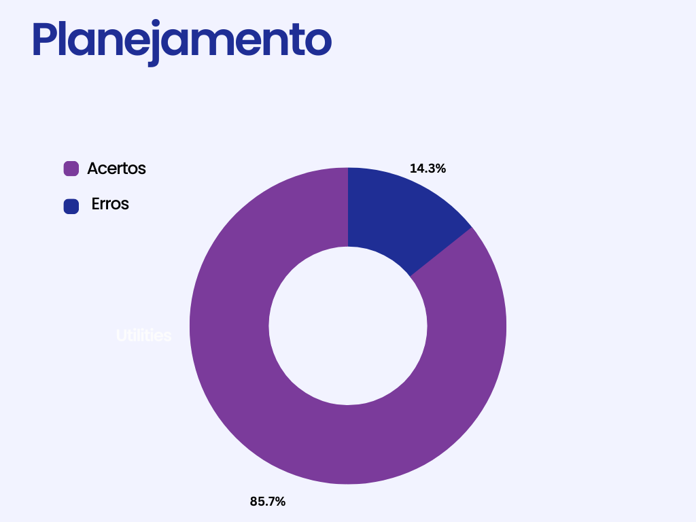

# Planejamento

## 1. Introdução

&emsp; O planejamento consiste na organização do grupo quanto ao cronograma planejado e realizado, como também a padronização do site e a introdução a tabelas e imagens realizada da forma correta.

## 2. Metodologia

&emsp; Como modelo para realizar a verificação foi seguido a tabela 1:

<figcaption align="center">Tabela 1: modelo de checklist</figcaption>

|       Código       |           Item           |     Total      |          Sim          |         Não         | Ocorrência de Erros  |
| :----------------: | :----------------------: | :------------: | :-------------------: | :-----------------: | :------------------: |
| Código do critério | Critério a ser analisado | Total de itens | Quantidade de acertos | Quantidade de erros | Porcentagem de erros |

<figcaption align="center">Fonte: Alexia</figcaption>

## 3. Verificação

&emsp; Para realizar a verificação do planejamento do grupo 6 (StarPlus) foi seguido o checklist disponível no plano de ensino da matéria de Requisitos de Software, que pode ser visualizada na tabela 2:

<figcaption align="center">Tabela 2: checklist do planejamento</figcaption>

| Código |                                                                     Item                                                                      | Total | Sim | Não | Ocorrência de erros |
| :----: | :-------------------------------------------------------------------------------------------------------------------------------------------: | ----- | --- | --- | ------------------- |
|   1    |                                                      O histórico de versão padronizado?                                                       | 15    | 13  | 2   | 13,3%               |
|   2    |                                             O(s) autor(es) e o(s) revisor(es) para cada artefato?                                             | 15    | 15  | 0   | 0%                  |
|   3    |                                               A motivação e os critérios para a escolha do App?                                               | 1     | 0   | 1   | 100%                |
|   4    |                                         Vídeo de apresentação na categoria “não listado” no YouTube?                                          | 4     | 4   | 0   | 0%                  |
|   5    |                                      Referências bibliográficas e/ou bibliografia em todos os artefatos?                                      | 15    | 14  | 1   | 6,7%                |
|   6    |                                As tabelas e imagens possuem legenda e fonte e elas chamadas dentro dos texto?                                 | 30    | 14  | 16  | 53,3%               |
|   7    |                                 Um texto fazendo uma introdução dos artefatos, por exemplo das “Ferramentas”?                                 | 7     | 0   | 7   | 100%                |
|   8    |                             Uma página apresentando os integrantes da equipe (com foto) com nome e sem matrícula?                             | 1     | 1   | 0   | 0%                  |
|   9    |                           O cronograma do planejamento apresenta todas as atividades de todas as etapas para cada.                            | 15    | 15  | 0   | 0%                  |
|   10   |                      Integrante com as datas de início e fim das entrega dos artefatos e com o período da revisão deles?                      | 15    | 15  | 0   | 0%                  |
|   11   |                         O cronograma do planejamento apresenta um período de gravação da apresentação de cada etapa.                          | 15    | 15  | 0   | 0%                  |
|   12   | O cronograma executado com quem realizou cada artefato/atividade com as datas de início e fim da construção/realização do artefato/atividade. | 15    | 15  | 0   | 0%                  |
|   13   |              Ata(s) da(s) reuniões (com data, horário de início e do final, participantes, objetivo, atividades definidas etc).               | 4     | 4   | 0   | 0%                  |
|   14   |                                                        A gravação da reunião do grupo.                                                        | 4     | 4   | 0   | 0%                  |
|   15   |                         No artefato “Rich Picture” possui uma legenda explicando os símbolos utilizados no diagrama?                          | 1     | 1   | 0   | 0%                  |
|   16   |               Todos os 5 componentes de um “Rich Picture” estão presentes no artefato do “Rich Picture” apresentado pelo grupo.               | 5     | 5   | 0   | 0%                  |

<figcaption align="center">Fonte: Alexia</figcaption>

<figcaption>Figura 1: Gráficos de defeitos de Planejamento do grupo 4</figcaption>
{width="400"}
<figcaption>Fonte: Alexia</figcaption>

### 3.1. Feedbacks

&emsp; Para notificar onde e o que mudar foi feita a tabela 3.

<figcaption align="center">Tabela 3: Feedbacks</figcaption>

| Código | Tipos de erro |                                                                                    Pontos a serem ajustados                                                                                     |
| :----: | :-----------: | :---------------------------------------------------------------------------------------------------------------------------------------------------------------------------------------------: |
|   1    |   Ausência    |                                    Sem o link para os perfis do Abdul e do Thiago no histórico de versão do cronograma de atividades e cronograma realizado                                     |
|   2    |     Erro      |                                        Na página de apresentações o histórico de versão da apresentação 4 tem como descrição "adiciona a apresentação 3"                                        |
|   3    |   Ausência    |                                                                         Não há referência bibliográfica no rich picture                                                                         |
|   4    |   Ausência    |                                               Não apresenta motivação e critérios de escolha apenas a apresentação do aplicativo e sua descrição                                                |
|   5    |   Ausência    |                                         Falta a fonte das tabelas da página de cronograma de atividades e cronograma realizado da parte de planejamento                                         |
|   6    |   Ausência    |                                                      Falta o título e fonte das imagens da página de ferramentas da parte de planejamento                                                       |
|   7    |   Ausência    |                                                            Falta título da imagem da página de metodologia da parte de planejamento                                                             |
|   8    | Padronização  |                                         A partir da tabela 5 de cronograma de atividades há somente data ao invés de data de início como nas anteriores                                         |
|   9    | Padronização  |                                                   Há tabelas com linhas vazias nas páginas de cronograma de atividades e cronograma realizado                                                   |
|   10   |     Erro      | Não tem como saber quem participou se tem todos, como o professor tinha comentado: pode haver alteração nos participantes do grupo, por isso deve haver os nomes de quem participou (reunião 1) |
|   11   |   Ausência    |                                                                   Falta a fonte da tabela de atividades de todas as reuniões                                                                    |

<figcaption align="center">Fonte: Alexia</figcaption>

### 3.2. Checklist

&emsp; Tendo em vista que alguns tópicos não foram realizados ou ficaram incompletos foi feita outra checklist para que o grupo pudesse seguir e corrigir alguns artefatos, como pode ser visto na 5:

<figcaption align="center">Tabela 4: checklist de correções</figcaption>

| Status                  | Correção                                                                                                                            |
| :---------------------- | ----------------------------------------------------------------------------------------------------------------------------------- |
| <input type="checkbox"> | Trocar "adiciona a apresentação 3" para "adiciona a apresentação 4" na página da apresentação 4                                     |
| <input type="checkbox"> | Adicionar link para os perfis do Abdul hannan e Thiago Vivan no histórico de versão do cronograma de atividades                     |
| <input type="checkbox"> | Adicionar link para os perfis do Abdul hannan e Thiago Vivan no histórico de versão do cronograma realizado                         |
| <input type="checkbox"> | Adicionar link para os perfis do João Pedro de Camargo Vaz e do Vinicius no histórico de versão da verificação destinada ao grupo 7 |
| <input type="checkbox"> | Adicionar motivação e critérios de escolha do aplicativo                                                                            |
| <input type="checkbox"> | Adicionar referência bibliográfica do rich picture                                                                                  |
| <input type="checkbox"> | Adicionar título e fonte das tabelas do cronograma das atividades                                                                   |
| <input type="checkbox"> | Adicionar título e fonte das tabelas do cronograma realizado                                                                        |
| <input type="checkbox"> | Adicionar título da imagem da parte de planejamento, em metodologias                                                                |
| <input type="checkbox"> | Padronizar tabelas de cronograma de atividades e cronograma realizado                                                               |
| <input type="checkbox"> | Adicionar fonte das tabelas das reuniões                                                                                            |
| <input type="checkbox"> | Adicionar o nome dos participantes da reunião 1                                                                                     |

<figcaption align="center">Fonte: Alexia</figcaption>     

## 4. Histórico de versão

| Data       | Versão | Modificações                                | Autor(es) | Revisor(es) |
| ---------- | ------ | ------------------------------------------- | --------- | ----------- |
| 07/01/2023 | 1.0    | Criação da Página de Planejamento           | Alexia    | Luiza       |
| 12/01/2023 | 1.1    | Criação do gráfico de erros                 | Lucas     | Luiza       |
| 12/01/2023 | 2.0    | Padronização de tabelas e mudança da imagem | Alexia    | Luiza       |

## 5. Bibliografia

> Plano de Ensino da disciplina de Requisitos de Software do curso de Engenharia de Software da Universidade de Brasilia ministrada pelo Dr. André Barros de Sales no semestre 02/2022.
