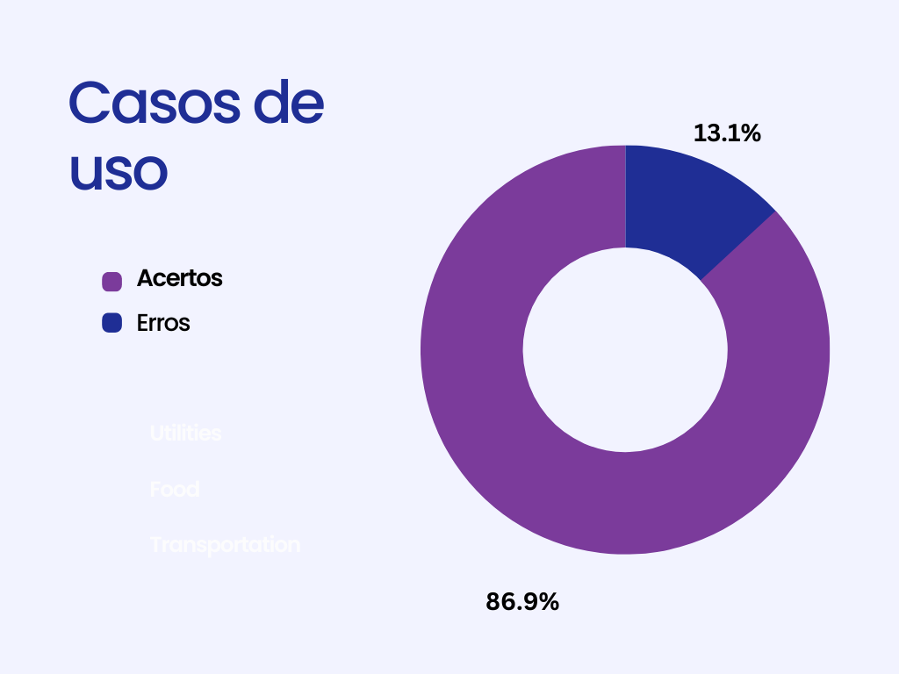
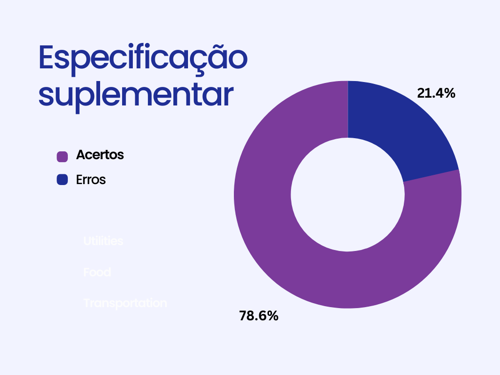

# Cenários, Léxico, Caso de Uso, Especificação Suplementar

## 1. Introdução

&emsp;&emsp; Nesta seção faremos uma inspeção dos artefatos desenvolvidos pelo grupo do [Star +]("https://requisitos-de-software.github.io/2022.2-StarPlus/#/"). Em especial os artefatos elaborados na entrega 3, a qual faz referência a: **Cenários**, **Léxicos**, **Casos de uso** e **Especificação suplementar**.

## 2. Cenários

 &emsp;&emsp; A seguir, a Tabela 1 mostra os resultados da verificação feita, com o que está devidamente cumprido e o que ficou pendente para possíveis melhorias dentro do contexto de **cenários**:

Tabela 1: Lista de Checagem: Cenários

| Código |                        Item                        | Total |  Sim  |  Não  | Ocorrência de Erros | Tipos de erro |                                                                       Pontos a serem ajustados                                                                        |
| :----: | :------------------------------------------------: | :---: | :---: | :---: | :-----------------: | :-----------: | :-------------------------------------------------------------------------------------------------------------------------------------------------------------------: |
|   1    |         Todos os cenários possuem títulos?         |  13   |  13   |   0   |        0.00%        |      ---      |                                                                                  ---                                                                                  |
|   2    |   Todos os cenários possuem todos os elementos?    |  13   |  13   |   0   |        0.00%        |      ---      |                                                                                  ---                                                                                  |
|   3    |      O objetivo de todos os cenários é claro?      |  13   |  12   |   1   |        7.00%        |    Clareza    |                                                                  C04: Remover título de qual lista?                                                                   |
|   4    |         Os contextos foram bem definidos?          |  13   |   2   |  11   |       84.00%        | Padronização  | Os contextos possuem pré-condições que não conversam entre si, tendo cenários sem pré-condições, e outros cenários com pré-condições incompletas, comparados a outros |
|   5    | Todos os recursos fazem sentido e são necessários? |  13   |   2   |  11   |       84.00%        | Padronização  |   Os recursos apresentam uma inconsistência entre os cenários, mostrando recursos não muito bem definidos quando os cenários são comparados (recursos não listados)   |
|   6    |      A exceção é condizente com a realidade?       |  13   |  13   |   0   |        0.00%        |      ---      |                                                                                  ---                                                                                  |
|   7    |          Os episódios são bem descritos?           |  13   |  13   |   0   |        0.00%        |      ---      |                                                                                  ---                                                                                  |
|   8    |    Os cenários fazem sentido com os requisitos?    |  13   |  13   |   0   |        0.00%        |      ---      |                                                                                  ---                                                                                  |

Fonte: Lucas Felipe e Iago Campelo

<figcaption>Imagem 1: Gráfico de defeitos de Cenários</figcaption>
{width="400"}
<figcaption>Fonte: Lucas Felipe</figcaption>

## 3. Casos de Uso

&emsp;&emsp; A seguir, a Tabela 2 mostra os resultados da verificação feita, com o que está devidamente cumprido e o que ficou pendente para possíveis melhorias dentro do contexto de **casos de uso**:

Tabela 2: Tabela de defeitos: Casos de Uso

| Código |                           Item                           | Total |  Sim  |  Não  | Ocorrência de Erros | Tipos de erro |  Pontos a serem ajustados  |
| :----: | :------------------------------------------------------: | :---: | :---: | :---: | :-----------------: | :-----------: | :------------------------: |
|   1    |           Os casos de uso estão especificados            |  13   |  13   |   0   |        0.00%        |               |                            |
|   2    |        Foram especificados os atores principais?         |  13   |  13   |   0   |        0.00%        |               |                            |
|   3    |    O ator principal está do lado esquerdo do sistema?    |  13   |  13   |   0   |        0.00%        |               |                            |
|   4    |   Os atores estão fora da caixa de limite do sistema?    |  13   |  13   |   0   |        0.00%        |               |                            |
|   5    | É apresentado a especificação do diagrama de caso de uso |  13   |  13   |   0   |        0.00%        |               |                            |
|   6    |            As relações include estão corretas            |   4   |   4   |   0   |        0.00%        |               |                            |
|   7    |          As relações de extends estão corretas           |   4   |   4   |   0   |        0.00%        |               |                            |
|   8    |                Apresenta rastreabilidade                 |  13   |  13   |   0   |        0.00%        |               |                            |
|   9    |     Apresenta legendas para os símbolos utilizados?      |  13   |   0   |  13   |       100.00%       |   Ausência    | Não possui nenhuma legenda |

Fonte: Lucas Felipe e Iago Campelo

<figcaption>Imagem 2: Gráfico de defeitos de casos uso</figcaption>
{width="400"}
<figcaption>Fonte: Lucas Felipe</figcaption>

## 4. Léxicos

&emsp;&emsp; A seguir, a Tabela 3 mostra os resultados da verificação feita, com o que está devidamente cumprido e o que ficou pendente para possíveis melhorias dentro do contexto de **Léxicos**:

Tabela 4: Lista de Checagem: Léxicos

| Código |                                                          Item                                                          | Total |  Sim  |  Não  | Ocorrência de Erros |   Tipos de erro    |    Pontos a serem ajustados    |
| :----: | :--------------------------------------------------------------------------------------------------------------------: | :---: | :---: | :---: | :-----------------: | :----------------: | :----------------------------: |
|   1    |                          Os léxicos possuem nome, noção, classificação, impactos e sinônimos?                          |  27   |  27   |   0   |        0.00%        |                    |                                |
|   2    |                                  Os léxicos possuem nome e noção coerentes entre si?                                   |  27   |  27   |   0   |        0.00%        |                    |                                |
|   3    |                        A noção de cada léxico está clara e define o que é o simbolo(denotação)?                        |  27   |  27   |   0   |        0.00%        |                    |                                |
|   4    |                     Os símbolos estão devidamente classificados (sujeito, objeto, verbo, estado)?                      |  27   |  27   |   0   |        0.00%        |                    |                                |
|   5    | Os impactos descrevem o efeito, uso ou coerência do símbolo no sistema ou efeito de algo na aplicação sobre o símbolo? |  27   |  27   |   0   |        0.00%        |                    |                                |
|   6    |                                    Os léxicos quando necessário, possuem sinônimos?                                    |  27   |  27   |   0   |        0.00%        |                    |                                |
|   7    |                                         Os léxicos possuem ligações entre si ?                                         |  27   |   0   |  27   |       100.00%       | Defeito de omissão | Adicionar HyperLex aos Léxicos |
|   8    |          Os Léxicos estão descritos em linguagem natural para uma comunicação saudável entre os stakeholders?          |  27   |  27   |   0   |        0.00%        |                    |                                |
|   9    |                                                     Possui rastro?                                                     |  27   |  27   |   0   |        0.00%        |                    |                                |

Fonte: Lucas Felipe e Iago Campelo

<figcaption>Imagem 3: Gráfico de defeitos de Léxicos</figcaption>
{width="400"}
<figcaption>Fonte: Lucas Felipe</figcaption>

## 5. Especificação Suplementar

&emsp;&emsp; A seguir, a Tabela 4 mostra os resultados da verificação feita, com o que está devidamente cumprido e o que ficou pendente para possíveis melhorias dentro do contexto de **Especificação Suplementar**:

Tabela 5: Lista de Checagem: Especificação Suplementar

| Código |                              Item                              | Sim | Não |      Tipo de Erro      |
|:------:|:--------------------------------------------------------------:|:---:|:---:|:----------------------:|
|   1    |                O artefato segue o modelo FURPS+                |  x  |     |                        |
|   2    |      o artefato versa sobre a facilidade de aprendizagem?      |     |  x  | Ausência de informação |
|   3    |              O artefato versa sobre a Eficiência?              |  x  |     |                        |
|   4    |       O artefato versa sobre a facilidade de recordação?       |     |  x  | Ausência de informação |
|   5    |              O artefato versa sobre a segurança?               |  x  |     |                        |
|   7    |         O artefato versa sobre a tolerância a falhas?          |  x  |     |                        |
|   8    |          O artefato versa sobre o tempo de resposta?           |  x  |     |                        |
|   9    |         O artefato versa sobre o consumo de recursos?          |  x  |     |                        |
|   10   |  O artefato versa sobre a adaptabilidade na suportabilidade?   |  x  |     |                        |
|   11   |           O artefato versa sobre a manutenibilidade?           |  x  |     |                        |
|   12   | O artefato versa sobre a compartibilidade, na suportabilidade? |  x  |     |                        |
|   13   |  O artefato versa sobre a escalabilidade, na suportabilidade?  |  x  |     |                        |
|   14   |                     Existe rastreabilidade                     |  x  |     |                        |

Fonte: Lucas Felipe e Iago Campelo

<figcaption>Imagem 4: Gráfico de defeitos de Especificação Suplementar</figcaption>
{width="400"}
<figcaption>Fonte: Lucas Felipe</figcaption>

## 6. Histórico de versão

|    Data    | Versão |                  Modificações                   | Autor(es) |       Revisor(es)        |
|:----------:|:------:|:-----------------------------------------------:|:---------:|:------------------------:|
| 05/01/2023 |  1.0   |       Criação da verificação de cenários        |   Lucas   |          Marcus          |
| 06/01/2023 |  1.1   |            Restruturação das pastas             |   Lucas   |          Marcus          |
| 08/01/2023 |  1.2   |       Correções ortográficas e de tabela        |   Iago    |         Luciano          |
| 08/01/2023 |  1.3   |                Finaliza tabelas                 |   Iago    |         Luciano          |
| 09/01/2023 |  1.4   | Adiciona referências as tabelas e bibliografia  |   Lucas   | Luciano e Marcus Martins |
| 11/01/2023 |  1.5   |        Adiciona os gráficos das tabelas         |   Lucas   |  Iago e Marcus Martins   |
| 22/01/2023 |  2.0   | Reformula a tabela de especificação suplementar |   Iago    |  Lucas e Marcus Martins  |

## 4. Bibliografia

> SERRANO, Milene. Requisitos - Aula 10. Local: UnB-FGA, Gama, DF. Apresentação de Power Point. 35, color. Disponível em: [Requisitos - Aula 10](https://aprender3.unb.br/pluginfile.php/1668162/mod_resource/content/1/Aula%2010.pdf). Acesso em: 08 de Dezembro de 2022.
> CONSTRUÇÃO do léxico de aplicações. Proceedings of the International Joint Conference IBERAMIA/SBIA/SBRN 2006 : 4th Workshop in Information and Human Language Technology, Ribeirão Preto, Brazil, 23 out. 2006. CD-ROM.
> ARMS, William Y.. CS 5150 Software Engineering Scenarios and Use Cases. Ithaca: Cornell University Computing And Information Science, 2014. 27 slides, color. Disponível em: [link](https://www.cs.cornell.edu/courses/cs5150/2014fa/slides/D2-use-cases.pdf. Acesso em: 07 dez. 2022).
> Lucid Chart; Diagrama de caso de uso UML: O que é, como fazer e exemplos. Disponível em: [link](https://www.lucidchart.com/pages/pt/diagrama-de-caso-de-uso-uml). Acesso em: 08 dez. 2022.
