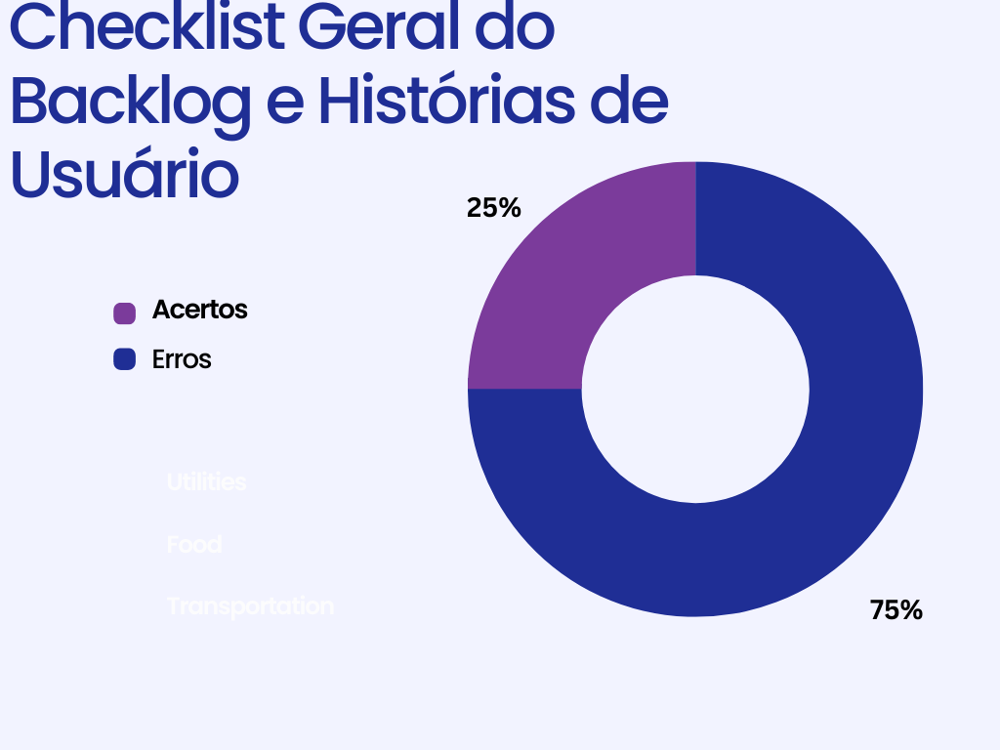
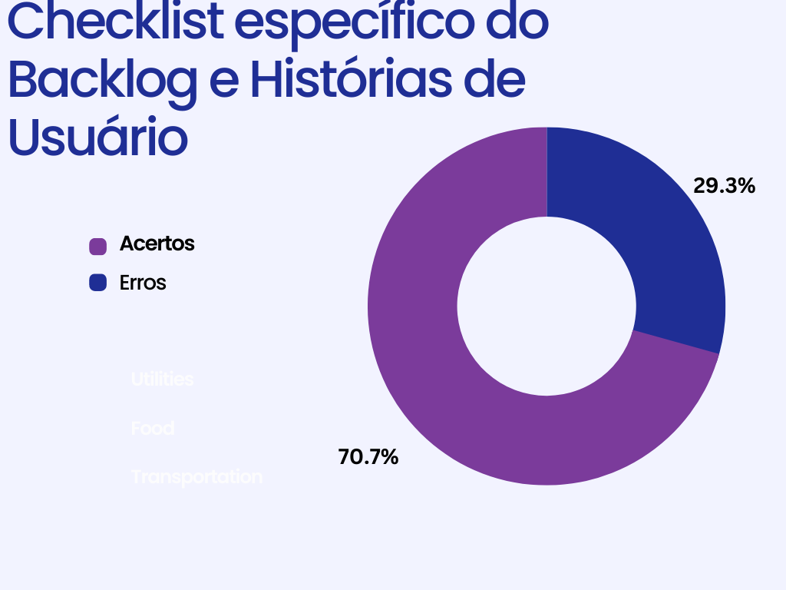
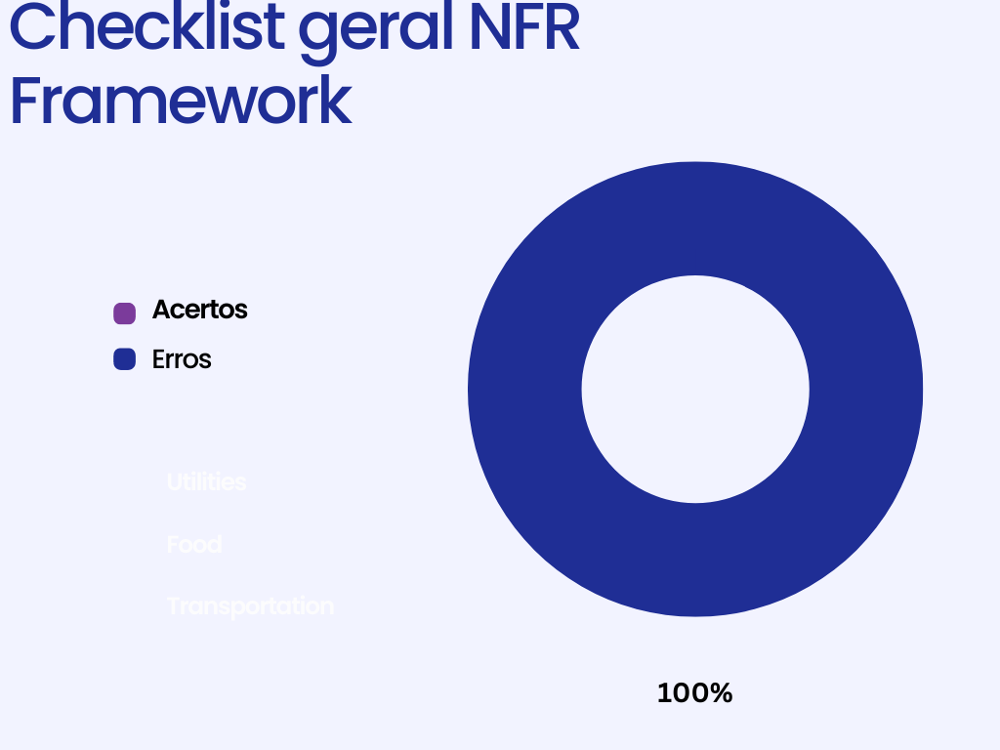
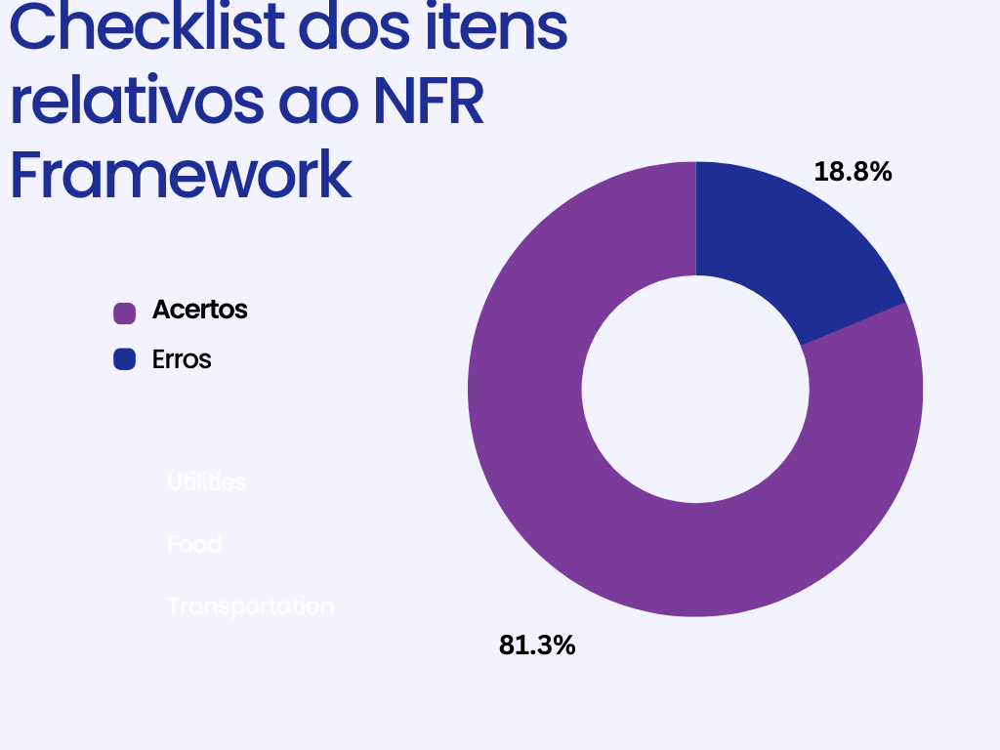

# Product Backlog, Histórias de Usuário, NFR Framework

## 1. Introdução

&emsp;&emsp; Documento criado para a **inspeção** dos artefatos de modelagem ágil (Product Backlog, Histórias de usuário e NFR Framework) desenvolvidos pelo grupo do [Star +](https://requisitos-de-software.github.io/2022.2-StarPlus/#). 

## 2. Product Backlog e Histórias de Usuário

&emsp;&emsp; Foi decidido que a inspeção do Product Backlog seria feita junto com a das histórias de usuário, já que o grupo optou por criar um artefato único para ambas. Na tabela 1 é possível observar o checklist geral do artefato, relativo as padronizações e explicações do documento. Enquanto isso, a tabela 2 apresenta os itens específicos do Backlog e das Histórias de Usuário.Ademais, na Figura 1 abaixo veremos no formato de gráfico como se deu a propagação dos erros para o caso mais geral. Enquanto, na figura 2 veremos em sua versão mais específica

Tabela 1: Checklist Geral do Backlog e Histórias de Usuário

| Código |                                     Item                                      | Total |  Sim  |  Não  | Taxa de Erros |            Tipos de erro             | Pontos a serem ajustados |
| :----: | :---------------------------------------------------------------------------: | :---: | :---: | :---: | :-----------: | :----------------------------------: | :----------------------: |
|   1    |     Histórico de versão padronizado, com autor e revisor para cada versão     |   1   |   1   |   0   |     0.00%     |                 ---                  |           ---            |
|   2    | Legendas e fontes de figuras e tabelas, além de citação das mesmas nos textos |   9   |   0   |   9   |    100.00%    | As tabelas não tem fonte nem legenda |           ---            |
|   3    |                          Referências bibliográficas                           |   1   |   1   |   0   |     0.00%     |                 ---                  |           ---            |
|   4    |                       Texto com introdução do artefato                        |   1   |   1   |   0   |     0.00%     |                 ---                  |           ---            |

Fonte: Luciano de Freitas

<figcaption>Figura 1: Gráfico de Product Backlog e Histórias de usuário Geral</figcaption>
{width="400"}
<figcaption>Fonte: Lucas Felipe</figcaption>

Tabela 2: Checklist específico do Backlog e Histórias de Usuário

| Código |                                         Item                                         | Total |  Sim  |  Não  | Taxa de Erros |                   Tipos de erro                   |                                                                        Pontos a serem ajustados                                                                        |
| :----: | :----------------------------------------------------------------------------------: | :---: | :---: | :---: | :-----------: | :-----------------------------------------------: | :--------------------------------------------------------------------------------------------------------------------------------------------------------------------: |
|   1    |                  Títulos das histórias de usuário auto-explicativos                  |  46   |   0   |  46   |    100.00%    | As histórias não possuem título, somente o código |                                                                                  ---                                                                                   |
|   2    | O “quem”, “o que” e o “por que” estão definidos na descrição da história de usuário? |  46   |  41   |   5   |    10.87%     | "por que" de algumas histórias estão incompletos  |              US05, US07 e US15 estão com os "por que" confusos ou redundantes. US41 - ferramentas não é explicado. US 43 - " O que" e "por que" confusos               |
|   3    |                       A História possui critérios de aceitação                       |  46   |  41   |   5   |    10.87%     |                Critérios confusos                 | US08 - o segundo critério é confuso.  US09 - seria bom explicar o que são dados válidos.  US12 - Critérios confusos de entender.  US31 e 32 - Critério muito genérico. |
|   4    |                  Todas as histórias de usuários podem ser testadas?                  |  46   |  45   |   1   |     2.17%     |           história não pode ser testada           |                                                                 US12 não parece ter como ser testada.                                                                  |
|   5    |                As Histórias de Usuário seguem algum modelo ou padrão?                |   1   |   1   |   0   |       0       |                                                   |                                                                                                                                                                        |
|   6    |      Participação do cliente e/ou persona na validação das histórias de usuário      |   1   |   0   |   1   |    100.00%    | Não há participação de nenhum cliente ou persona  |                                                                                                                                                                        |
|   7    |              O backlog possui épicos e temas bem definidos e descritos?              |   3   |   3   |   0   |     0.00%     |                                                   |                                                                                                                                                                        |
|   8    |                  Todas as features são condizentes com seus épicos?                  |   8   |   8   |   0   |     0.00%     |                                                   |                                                                                                                                                                        |
|   9    |                 Existe rastreabilidade com os requisitos elicitados?                 |   1   |   1   |   0   |     0.00%     |                                                   |                                                                                                                                                                        |

Fonte: Luciano de Freitas

<figcaption>Figura 2: Gráfico de Product Backlog e Histórias de usuário Específico</figcaption>
{width="400"}
<figcaption>Fonte: Lucas Felipe</figcaption>

## 3. NFR Framework

&emsp;&emsp; Como anteriormente, a tabela 3 apresenta o checklist geral do artefato, enquanto que a tabela 4 mostra  a inspeção dos itens relativos ao NFR Framework.Ademais, na Figura 3 abaixo veremos no formato de gráfico como se deu a propagação dos erros para o caso mais geral. Enquanto, na figura 4 veremos em sua versão mais específica

<figcaption>Tabela 3: Checklist geral NFR Framework</figcaption>

| Código |                                     Item                                      | Total |  Sim  |  Não  | Taxa de Erros | Tipos de erro | Pontos a serem ajustados |
| :----: | :---------------------------------------------------------------------------: | :---: | :---: | :---: | :-----------: | :-----------: | :----------------------: |
|   1    |     Histórico de versão padronizado, com autor e revisor para cada versão     |   1   |   1   |   0   |     0.00%     |      ---      |           ---            |
|   2    | Legendas e fontes de figuras e tabelas, além de citação das mesmas nos textos |   9   |   9   |   0   |     0.00%     |               |           ---            |
|   3    |                          Referências bibliográficas                           |   1   |   1   |   0   |     0.00%     |      ---      |           ---            |
|   4    |                       Texto com introdução do artefato                        |   1   |   1   |   0   |     0.00%     |      ---      |           ---            |

<figcaption>Fonte: Luciano de Freitas</figcaption>

<figcaption>Figura 3: Gráfico de NFR Framework Geral</figcaption>
{width="400"}
<figcaption>Fonte: Lucas Felipe</figcaption>

<figcaption>Tabela 4: Checklist dos itens relativos ao NFR Framework</figcaption>

| Código |                          Item                          | Total |  Sim  |  Não  | Taxa de Erros |           Tipos de erro            |   Pontos a serem ajustados    |
| :----: | :----------------------------------------------------: | :---: | :---: | :---: | :-----------: | :--------------------------------: | :---------------------------: |
|   1    |         Os softgoals condizem com o contexto?          |   3   |   3   |   0   |     0.00%     |                                    |                               |
|   2    |       Softgoals representam metas bem definidas?       |   3   |   3   |   0   |     0.00%     |                                    |                               |
|   3    |       Os impactos foram corretamente propagados?       |   3   |   3   |   0   |     0.00%     |                                    |                               |
|   4    | Há uma legenda para cada elemento usado nos diagramas? |   7   |   4   |   3   |    42.86%     | Elementos do diagrama sem legendas | Os elementos são: "S+" e "W+" |

<figcaption>Fonte: Luciano de Freitas</figcaption>

<figcaption>Figura 4: Gráfico de NFR Framework Específico</figcaption>
{width="400"}
<figcaption>Fonte: Lucas Felipe</figcaption>

## 4. Histórico de versão

|    Data    | Versão |                      Modificações                      | Autor(es) | Revisor(es) |
| :--------: | :----: | :----------------------------------------------------: | :-------: | :---------: |
| 07/01/2023 |  1.0   | Criação do artefato: inspeção das histórias de usuário |  Luciano  |     Lucas   |
| 08/01/2023 |  1.1   |           Tópicos de Backlog e NFR Framework           |  Luciano  |   Lucas     |
| 12/01/2023 |  1.2   |           Adiciona os gráficos e altera as descrições dos textos           |  Lucas  |   Luciano     |

## 5. Bibliografia

> SERRANO, Milene; SERRANO, Mauricio. Requisitos – Aula 17. 2019. Disponível em: [link](https://aprender3.unb.br/pluginfile.php/2307541/mod_resource/content/1/Requisitos%20-%20Aula%20019a.pdf) Acesso em: 07 jan. 2023

> Projeto de Requisitos - TIKTOK 2022.1. Disponível em: [link](https://requisitos-de-software.github.io/2022.1-TikTok/). Acesso em: 07 jan. 2023

> Projeto de Requisitos - Youtube 2022.1. Disponível em: [link](https://requisitos-de-software.github.io/2022.1-Youtube/). Acesso em: 08 jan. 2023