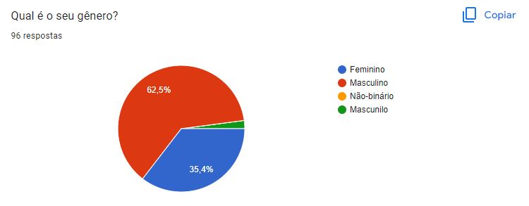
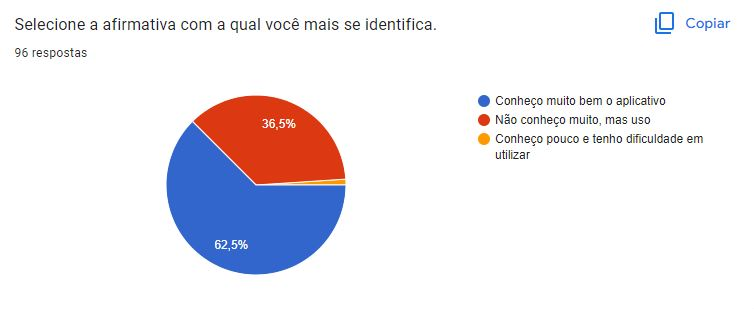
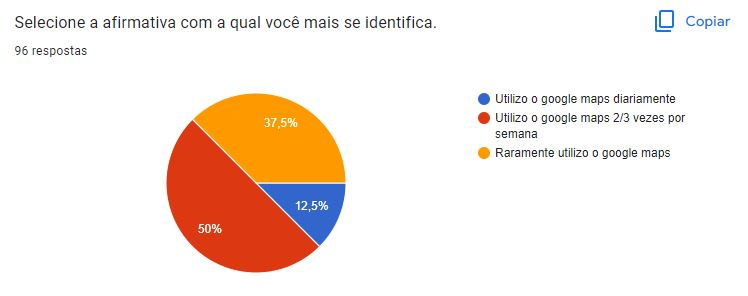
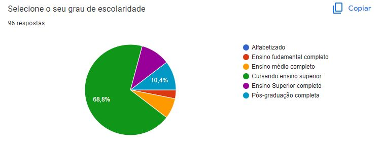
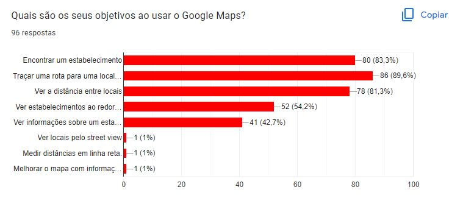
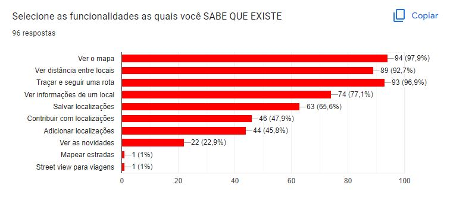
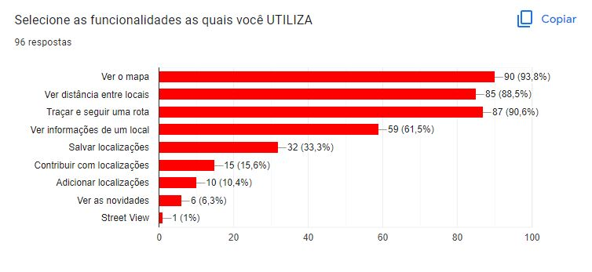

# Questionário

## 1. Introdução

&emsp;&emsp; A técnica de questionário visa obter informações de um público maior, que nem sempre possui disponibilidade para participar de uma entrevista e consegue-se realizar a análise de resultados de forma mais rápida.

## 2. Metodologia

&emsp;&emsp; Para a utilização da técnica de questionário, foi utilizado o Google Forms para criação do corpo do formulário e feita uma revisão das questões pela equipe. A forma de obter respostas foi enviando o link em grupos com perfis dentro do que foi estabelecido. Assim, após a finalização, será feito um refinamento das respostas para garantir uma maior precisão dos resultados.

&emsp;&emsp; É importante que na fase de preparação sejam elencados os objetivos, informações e qual o público-alvo para que o questionário seja respondido de forma coerente. Para aumentar a veracidade das perguntas o formulário não pediu identificação dos usuários, apenas informações sobre o perfil.

&emsp;&emsp; Dentro desse aspecto, o questionário pode ser montado com dois tipos de perguntas, as abertas que o entrevistado pode responder da maneira que ele considera melhor e fechadas que dão um direcionamento mais objetivo nas respostas. Utilizamos o Google Forms para fazer o questionário, nele preparamos perguntas fechadas e abertas ao mesmo tempo(híbridas) pois existiam opções, mas caso o respondente quisesse ele poderia adicionar uma opção ou mais.

&emsp;&emsp; O questionário foi dividido em 3 partes: introdução e triagem, perfil do usuário e análise do aplicativo. Caso o usuário não tiver utilizado o Google Maps ele não pode responder o questionário.

### 2.1. Perguntas

&emsp;&emsp; Sendo assim, foram 6 questões de escolha única fechadas, 1 questão de escolha única híbrida, 3 questões de escolha múltipla híbridas e uma pergunta aberta. Abaixo estão as nossas perguntas e em seguida as opções, em caso de "Outro" o Google Forms abre uma caixa para escrita.

1. **Você já usou o Google Maps?** Sim ou Não.
2. **Qual é a sua faixa etária?** Menor que 17 anos; 17 a 20 anos; 21 a 39 anos; 40 a 59 anos; Maior que 59 anos.
3. **Qual é o seu gênero?**  Feminino, Masculino, Não-binário, Outros.
3. **Selecione a afirmativa com a qual você mais se identifica.** Conheço muito bem o aplicativo; Não conheço muito, mas uso; Conheço pouco e tenho dificuldade em utilizar.
4. **Selecione a afirmativa com a qual você mais se identifica.** Utilizo o google maps diariamente; Utilizo o google maps 2/3 vezes por semana; Raramente utilizo o google maps.
5. **Selecione o seu grau de escolaridade.** Alfabetizado; Ensino fundamental completo; Ensino médio completo; Cursando ensino superior; Ensino Superior completo; Pós-graduação completa.
6. **Quais são os seus objetivos ao usar o Google Maps?** Encontrar um estabelecimento; Traçar uma rota para uma localização; Ver a distância entre locais; Ver estabelecimentos ao redor de uma localização; Ver informações sobre um estabelecimento; Outros.
7. **Selecione as funcionalidades as quais você SABE QUE EXISTE.** Ver o mapa; Ver distância entre locais; Traçar e seguir uma rota; Ver informações de um local; Salvar localizações; Contribuir com localizações; Adicionar localizações; Ver as novidades; Outros.
8. **Selecione as funcionalidades as quais você UTILIZA.** Ver o mapa; Ver distância entre locais; Traçar e seguir uma rota; Ver informações de um local; Salvar localizações; Contribuir com localizações; Adicionar localizações; Ver as novidades; Outros.
9. **Comparando outros aplicativos de mobilidade qual é a sua prioridade em usar o Google Maps?** Prefiro o Google Maps a outros; Dependendo da funcionalidade eu uso o Google Maps; Em último caso uso o Google Maps.

## 3. Resultados

&emsp;&emsp; No dia da análise dos resultados (27/11/2022) foram obtidas 96 respostas. O questionário foi espalhado em grupos de redes sociais de diferentes ambientes para tentar obter os mais variados tipos de usuário. Os resultados obtidos foram:

Pergunta 1: Como esperado somente quem já utilizou o aplicativo conseguiu responder ao questionário como pode ser observado na figura 1.

<figure markdown >
  <figcaption>Figura 1 - Pergunta 1 do Google Forms</figcaption>

  <figcaption>Fonte: Alexia</figcaption>
</figure>

Pergunta 2: A maior parte das respostas foi de 17 a 20 anos demonstrado no gráfico da figura 2, porém foi uma diferença apenas de 2,1% entre o grupo 17 a 20 e o grupo 21 a 39 anos.

<figure markdown >
  <figcaption>Figura 2 - Pergunta 2 do Google Forms</figcaption>

  <figcaption>Fonte: Alexia</figcaption>
</figure>

Pergunta 3: Inicialmente houve um erro ortográfico na opção masculino, como pode ser observado na figura 3, e algumas pessoas ainda selecionaram antes da correção, então definimos que os resultados de 'mascunilo' e 'Masculino' se referem ao mesmo grupo.

<figure markdown >
  <figcaption>Figura 3 - Pergunta 3 do Google Forms</figcaption>

  <figcaption>Fonte: Alexia</figcaption>
</figure>

Pergunta 4: A maioria já conhecia o aplicativo e sabia utilizá-lo muito bem de acordo com a figura 4.

<figure markdown >
  <figcaption>Figura 4 - Pergunta 4 do Google Forms</figcaption>

  <figcaption>Fonte: Alexia</figcaption>
</figure>

Pergunta 5: A maioria utiliza o Google Maps de 2/3 vezes por semana, como demonstrado na figura 5.

<figure markdown >
  <figcaption>Figura 5 - Pergunta 5 do Google Forms</figcaption>

  <figcaption>Fonte:  Alexia</figcaption>
</figure>

Pergunta 6: A figura 6 mostra o gráfico o qual diz que a maioria está cursando o Ensino Superior.

<figure markdown >
  <figcaption>Figura 6 - Pergunta 6 do Google Forms</figcaption>

  <figcaption>Fonte:  Alexia</figcaption>
</figure>

Pergunta 7: A maioria utiliza o aplicativo para traçar uma rota para uma localização de acordo com a figura 7.

<figure markdown >
  <figcaption>Figura 7 - Pergunta 7 do Google Forms</figcaption>

  <figcaption>Fonte: Alexia</figcaption>
</figure>

Pergunta 8: A maioria conhece as funcionalidades de ver mapa(94) para traçar rota(93) tendo uma diferença de apenas uma seleção entre as duas opções como pode ser observado na figura 8.

<figure markdown >
  <figcaption>Figura 8 - Pergunta 8 do Google Forms</figcaption>

  <figcaption>Fonte:  Alexia</figcaption>
</figure>

Pergunta 9: A maioria utiliza a opção de ver mapa de acordo com a figura 9.

<figure markdown >
  <figcaption>Figura 9 - Pergunta 9 do Google Forms</figcaption>

  <figcaption>Fonte: Alexia</figcaption>
  </figure>

Pergunta 10: A maioria prefere o Google Maps a outros aplicativos como demonstra a figura 10. Abrimos uma pergunta aberta para que selecionasse as outras opções e recebemos respostas relacionadas a: familiaridade com outros aplicativos, informações de trânsito que o Google Maps não fornece, achar o navegador de outro aplicativo mais fácil, interface mais amigável, rotas melhores e afirmações sobre o Google Maps estar desatualizado.

<figure markdown >
  <figcaption>Figura 10 - Pergunta 10 do Google Forms</figcaption>

  <figcaption>Fonte:  Alexia</figcaption>
</figure>

### 3.1 Finalização

Foi possível entender mais do perfil dos usuários que usam o aplicativo. Na tabela 1 pode-se ver os requisitos que conseguimos coletar dos questionários:

<figcaption align="center">Tabela 1: Tabela de requisitos elicitados</figcaption>
| Descrição                                                                                             | Tipo  | id  |
| ----------------------------------------------------------------------------------------------------- | ----- | --- |
| Deve ser possível pesquisar um estabelecimento                                                        | RF01  | 03  |
| Deve ser possível traçar uma rota                                                                     | RF02  | 03  |
| Deve ser possível ver distância entre locais                                                          | RF03  | 03  |
| Deve ser possível ver estabelecimentos no mapa                                                        | RF04  | 03  |
| Deve ser possível ver informações sobre um estabelecimento                                            | RF05  | 03  |
| Deve ser possível navegar pelo mapa pelo modo street view                                             | RF06  | 03  |
| Deve ser possível melhorar o mapa adicionando informações de locais                                   | RF07  | 03  |
| Deve ser possível salvar localizações buscadas                                                        | RF08  | 03  |
| Deve ser possível ver novos comentários e avaliações de outros usuários de estabelecimentos quaisquer | RF09  | 03  |
| As rotas devem ser traçadas de acordo com as políticas de trânsito de cada cidade                     | RNF01 | 03  |

<figcaption align="center">Fonte: Alexia</figcaption>

## 4. Histórico de versão

|    Data    | Versão |          Modificações          |   Autor(es)    | Revisor(es) |
| :--------: | :----: | :----------------------------: | :------------: | :---------: |
| 24/11/2022 |  1.0   |       Criação da pagina        |     Luiza      |    Lucas    |
| 27/11/2022 |  2.0   |   Complemento com resultados   |     Alexia     |    Lucas    |
| 05/12/2022 |  3.0   | Adiciona tabela com requisitos |     Alexia     |    Iago     |
| 07/12/2022 |  3.1   |    Padronização do artefato    |    Luciano     |    Lucas    |
| 13/12/2022 |  3.2   |    Adiciona id nas tabelas     |     Alexia     |   Marcus    |
| 17/12/2022 |  3.3   | Padroniza autores das tabelas  |     Lucas      |   Alexia    |
| 18/01/2023 |  4.0   |      Correção do artefato      | Luíza e Alexia |    Lucas    |

## 5. Bibliografia

> VAZQUEZ,Engenharia de Requisitos. Disponível em: [link](https://aprender3.unb.br/pluginfile.php/2307485/mod_resource/content/3/Elicitacao%20de%20Req%202.pdf/) Acesso em nov. de 2022.