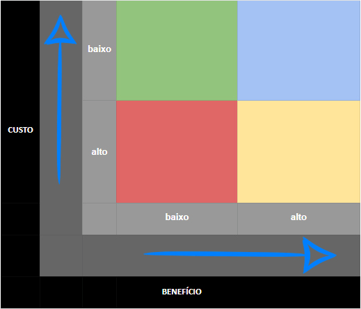

# Priorização

## 1. Introdução

&emsp;&emsp; A priorização é uma técnica de elicitação de requisitos que consiste em ordenar os requisitos de acordo com a importância que eles possuem para o usuário. Essa técnica é utilizada para que os requisitos mais importantes sejam implementados primeiro, e assim, o usuário possa utilizar o sistema com mais facilidade e rapidez. O id dos requisitos foi adicionado nas tabelas: 01 para requisitos elicitados a partir das entrevistas, 02 para requisitos elicitados a partir da observação e 03 requisitos elicitados a partir da priorização.

## 2. Técnicas utilizadas

&emsp;&emsp; A priorização foi realizada através de três técnicas: Custo x Benefício, BASICO e MOSCoW. As técnicas escolhidas foram selecionadas pois são simples de avaliar os requisitos e não precisam de um cliente para serem priorizados.

&emsp;&emsp; A seguir, serão apresentadas as técnicas utilizadas e os requisitos priorizados. Os requisitos utilizados são especificados na seção #4 página de [Entrevistas](4.entrevista.md).

### 2.1. BASICO

&emsp;&emsp;A Matriz BASICO costuma ser usada para auxiliar em decisões importantes. Por meio de uma escala de notas de 1 (pior cenário) a 5 (melhor cenário), qualquer pessoa consegue mapear tarefas e ações por prioridades. O nome desse método de priorização tem relação com a inicial de cada critério que é preciso considerar para a pontuação, como:

- **B**enefícios para a empresa;
- **A**brangência dos resultados;
- **S**atisfação do cliente interno;
- **I**nvestimento necessário;
- **C**liente externo satisfeito;
- **O**peracionalidade simples.

&emsp;&emsp;Cada um desses itens deve receber uma nota **— de 1 a 5 —** conforme sua relevância dentro de um projeto, ação, tarefa ou processo.

&emsp;&emsp;Depois de somar a nota de cada tópico, use a pontuação total para comparar com as notas de outras necessidades em sua agenda. Pronto! Você já sabe o que precisa ser feito antes e o que pode esperar.

#### 2.1.1. Aplicação

&emsp;&emsp;A pontuação dos requisitos é dada de acordo com a tabela 1:

<figcaption align="center">Tabela 1: Requisitos em BASICO</figcaption>

| Requisito | B   | A   | S   | I   | C   | O   | Total |
| :-------- | :-- | :-- | :-- | :-- | :-- | :-- | :---- |
| RF01      | 5   | 2   | 5   | 3   | 5   | 2   | 22    |
| RF02      | 5   | 4   | 5   | 1   | 1   | 4   | 20    |
| RF03      | 1   | 5   | 5   | 1   | 4   | 1   | 17    |
| RF04      | 5   | 2   | 5   | 2   | 5   | 4   | 23    |
| RF05      | 3   | 3   | 3   | 1   | 5   | 5   | 20    |
| RF06      | 2   | 5   | 5   | 5   | 5   | 1   | 23    |
| RNF01     | 5   | 5   | 4   | 5   | 5   | 3   | 27    |

<figcaption align="center">Fonte: Iago</figcaption>

&emsp;&emsp; Após a pontuação, os requisitos foram ordenados de acordo com a pontuação total, sendo o requisito com maior pontuação o mais importante. A sequência de priorização dos requisitos é apresentada na tabela 2 a seguir:

<figcaption align="center">Tabela 2: Requisitos priorizados em BASICO </figcaption>

| Ordem de prioridade |  Requisito  | id  |
| :-----------------: | :---------: | --- |
|          1          |    RNF01    | 01  |
|          2          | RF04 e RF06 | 01  |
|          3          |    RF01     | 01  |
|          4          | RF02 e RF05 | 01  |
|          5          |    RF03     | 01  |

<figcaption align="center">Fonte: Iago </figcaption>

&emsp;&emsp; O link para o vídeo da aplicação da técnica BASICO pode ser acessado [aqui](https://youtu.be/Pq_891Akk_Y).

### 2.2. Custo x Benefício

&emsp;&emsp;Esse método de priorização de projetos é o mais fácil de compreender, afinal muitas pessoas já estão familiarizadas com o termo “custo x benefício”. Nesse caso, a matriz ajuda a esclarecer qual o valor de um projeto e a relação disso com o resultado esperado do projeto. Para fazer esse balanço, utilizamos uma matriz dividida por cores e quadrantes, como mostra a figura 1:

<figure markdown>
<figcaption>Figura 1 - Matriz Custo x Benefício</figcaption>

<figcaption>Fonte: rockcontent.com.br</figcaption>
</figure>

&emsp;&emsp;Com a matriz custo x benefício não é preciso calcular nada, apenas pegar os dados previstos para o seu projeto e encaixá-los nos quadrantes coloridos.

&emsp;&emsp;A lógica das cores nesse método, é:

- Vermelho: representa o pior resultado possível, com custo elevado e baixo retorno;
- Amarelo: mostra um resultado intermediário, em que o custo e o benefício são considerados ok;
- Verde: se trata de um projeto com baixo custo, mas que não trará muitos benefícios;
- Azul: é a melhor das opções, pois representa os melhores resultados possíveis para um projeto.

#### 2.2.1. Aplicação

&emsp;&emsp;Os requisitos foram colocados em cada quadrante de acordo com a sua importância e o seu custo. A figura 2 apresenta os requisitos em cada quadrante:

<figcaption align="center">Figura 2: Requisitos em Custo x Benefício</figcaption>

<figcaption align="center">Fonte: Iago</figcaption>

&emsp;&emsp; O link para o vídeo da aplicação da técnica Custo x Benefício pode ser acessado [aqui](https://youtu.be/wPYxSMKpp8o).

### 2.3 MoSCoW

&emsp;&emsp;O método MoSCoW divide os requisitos em quatro prioridades, que são definidas de acordo com a importância que o requisito possui para o usuário. As quatro prioridades são:

- **Must**: Para requisitos que devem ser satisfeitos para que a solução seja um sucesso.
- **Should**: Aqueles que deveriam ser incluídos na solução, se possível, mas não são obrigatórios para o sucesso.
- **Could**: Inclui capacidades desejadas que serão implementadas caso o tempo e os recursos permitam.
- **Won't**: Indica requisitos que não serão implementados por agora, mas podem ser incluídos em entregas futuras.

#### 2.3.1 Aplicação

&emsp;&emsp; **Cronograma de entrevistas**: Foi realizado um cronograma para as entrevistas com as personas do projeto, afim de priorização dos requisitos com cada uma. O cronograma está apresentado na tabela 3.

<figcaption align="center">Tabela 3: Cronograma de entrevistas</figcaption>

| Data       | Hora  | Persona entrevistada | Entrevistador |
| ---------- | ----- | -------------------- | ------------- |
| 30/11/2022 | 17:35 | Manuel Gomes         | Marcus        |
| 30/11/2022 | 17:55 | Juliana Almeida      | Iago          |
| 30/11/2022 | 18:15 | Carolina Silveira    | Marcus        |
| 30/11/2022 | 18:30 | Ricardo Mendes       | Iago          |

<figcaption align="center">Fonte: Iago </figcaption>

&emsp;&emsp; **Manuel Gomes (persona primária)**: A tabela 4 apresenta os requisitos priorizados junto a persona Manuel Gomes.

<figcaption align="center">Tabela 4: Requisitos priorizados com Manuel em MOSCoW </figcaption>

| MOSCoW |     Requisito     | id  |
| :----: | :---------------: | --- |
|  Must  | RF01, RF04, RNF01 | 01  |
| Should |    RF05, RF06     | 01  |
| Could  |       RF02        | 01  |
| Won't  |       RF03        | 01  |

<figcaption align="center">Fonte: Marcus </figcaption>

&emsp;&emsp; O link para o vídeo da aplicação da técnica MoSCoW com o Manuel Gomes pode ser acessado [aqui](https://youtu.be/cihl-itrQKk).

&emsp;&emsp; **Juliana Almeida (anti-persona)**: Na tabela 5 é possível visualizar os requisitos elicitados com essa persona.

<figcaption align="center">Tabela 5: Requisitos priorizados com Juliana em MOSCoW </figcaption>

| MOSCoW |     Requisito     | id  |
| :----: | :---------------: | --- |
|  Must  | RF02, RF05, RNF01 | 01  |
| Should |       RF01        | 01  |
| Could  |       RF06        | 01  |
| Won't  |    RF03, RF04     | 01  |

<figcaption align="center">Fonte: Iago </figcaption>

&emsp;&emsp; O link para o vídeo da aplicação da técnica MoSCoW com a Juliana Almeida pode ser acessado [aqui](https://youtu.be/8MzfqGi_kCk).

&emsp;&emsp; **Carolina Silveira (persona secundária)**: A tabela 6 apresenta os requisitos priorizados em conjunto com a persona Carolina Silveira.

<figcaption align="center">Tabela 6: Requisitos priorizados com Carolina em MOSCoW </figcaption>

| MOSCoW |    Requisito     | id  |
| :----: | :--------------: | --- |
|  Must  | RF01, RF02, RF04 | 01  |
| Should |    RF05, RF06    | 01  |
| Could  |                  | 01  |
| Won't  |   RF03, RNF01    | 01  |

<figcaption align="center">Fonte: Marcus </figcaption>

&emsp;&emsp; O link para o vídeo da aplicação da técnica MoSCoW com a Carolina Silveira pode ser acessado [aqui](https://youtu.be/A-rQizDWEFw).

&emsp;&emsp; **Ricardo Mendes (persona secundária)**: Os requisitos priorizados pela persona Ricardo Mendes estão apresentados na tabela 7.

<figcaption align="center">Tabela 7: Requisitos priorizados com Ricardo em MOSCoW </figcaption>

| MOSCoW |    Requisito     | id  |
| :----: | :--------------: | --- |
|  Must  | RF01, RF02, RF05 | 01  |
| Should |       RF06       | 01  |
| Could  |       RF04       | 01  |
| Won't  |   RF03, RNF01    | 01  |

<figcaption align="center">Fonte: Iago </figcaption>

&emsp;&emsp; O link para o vídeo da aplicação da técnica MoSCoW com o Ricardo Mendes pode ser acessado [aqui](https://youtu.be/RB4gYeuXv3c).

## 3. Conclusão

&emsp;&emsp;De acordo com as técnicas de priorização utilizadas, os requisitos mais importantes para o sistema são apresentados nessa sequência: RNF01, RF01, RF02, RF04, RF06, RF05, RF03. Esses requisitos foram priorizados de acordo com a importância que eles possuem para o usuário, sendo que os requisitos que possuem maior pontuação são os mais importantes.

## 4. Histórico de Versões

| Data       | Versão | Modificações                                                        | Autor(es)     | Revisor(es) |
| ---------- | ------ | ------------------------------------------------------------------- | ------------- | ----------- |
| 30/11/2022 | 1.0    | Criação da Página e Requisitos Priorizados                          | Iago e Marcus | Lucas       |
| 30/11/2022 | 1.1    | Adição de Vídeos de Aplicação                                       | Iago e Marcus | Lucas       |
| 06/12/2022 | 2.0    | Adição das tabelas de priorização                                   | Marcus        | Lucas       |
| 06/12/2022 | 2.1    | Adição dos Motivos da escolhas das técnicas                         | Marcus        | Lucas       |
| 07/12/2022 | 3.0    | Junção das técnicas de priorização com esse artefato e padronização | Luciano       | Lucas       |
| 13/12/2022 | 3.1    | Atualiza tabelas com id identificador da técnica do requisito       | Alexia        | Marcus      |

## 5. Bibliografia

> CONTENT, Rock. Saiba quais são as 6 principais metodologias usadas para priorização de projetos. Disponível em: [link](https://rockcontent.com/br/blog/priorizacao-de-projetos/) Acesso em nov. de 2022.

> RIBEIRO, Renato. Matriz BASICO: descubra o que é e como ela pode ajudar o seu negócio. Disponível em: [link](https://rockcontent.com/br/blog/matriz-basico/). Acesso em nov. de 2022.

> Software Requirements, 3ª edição - Karl Wiegers & Joy Beatty. Acesso em nov. de 2022.
