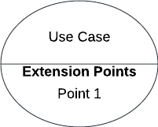
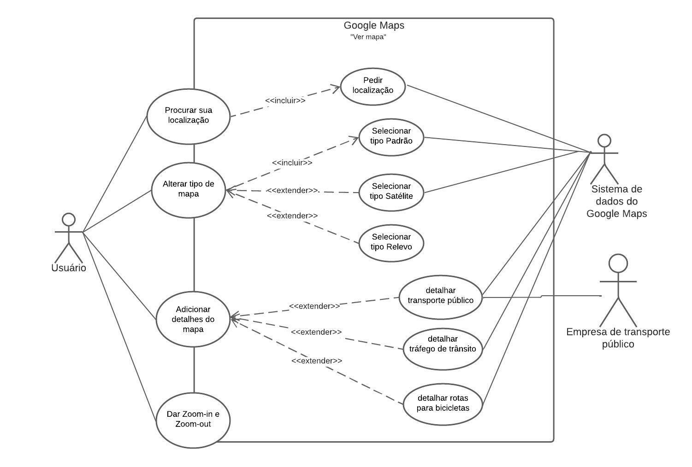
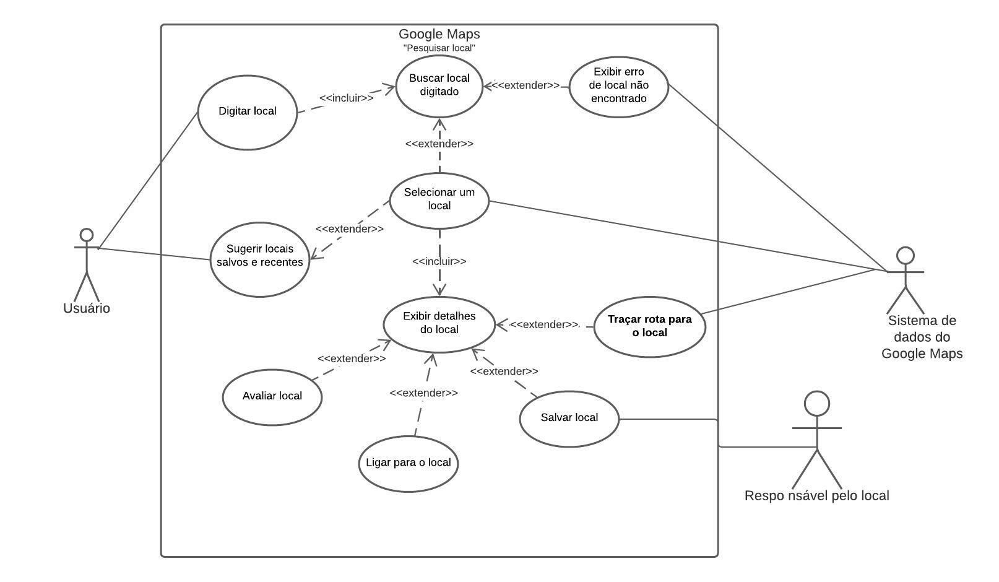
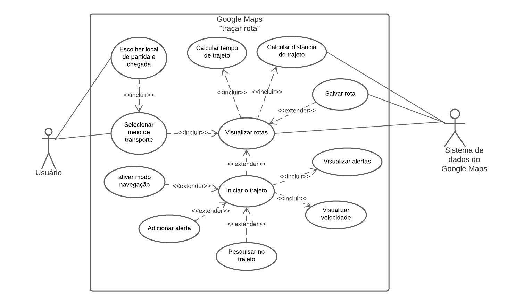

# Casos de Uso

## 1. Introdução

&emsp;&emsp;O Diagrama de Caso de uso é uma representação das interações entre o usuário e o sistema. Dentro desse modelo, existem vários símbolos que representam diferentes estruturas e atividades.

&emsp;&emsp;Esse diagrama auxilia na discussão de cenários, definição de metas e o escopo que o sistema atenderá. Por não ter tantos detalhes, geralmente o diagrama é acompanhado de uma descrição.

[Definições, acrônimos e abreviações](../1.lexicos/#5-definicoes-acronimos-e-abreviacoes)

## 2. Metodologias

&emsp;&emsp; Após a realização da elicitação, foi possível levantar as principais atividades do sistema que precisariam estar dentro da modelagem do diagrama. Para fazê-lo, foi definido como ferramenta o LucidChart, que possui os componentes necessários.

### 2.1.Elementos do diagrama

&emsp;&emsp;É importante que fique claro o que cada elemento dentro da diagramação significa. A Tabela 1 abaixo identifica cada ponto dentro dos diagramas elaborados:

<figcaption align="center">Tabela 1: Descrição de elementos do diagrama</figcaption>

|       Nome        |                                          Função                                           |                                    Elemento                                     |
| :---------------: | :---------------------------------------------------------------------------------------: | :-----------------------------------------------------------------------------: |
|       Ator        |                 Representam usuários que fazem a interação com o sistema                  |          {width="40" height="40"}          |
|    Caso de uso    |                  Representam os diferentes usos que o usuário pode fazer                  |        {width="80" height="80"}         |
| Ponto de extensão | Representam sequências de comportamento que fazem descrição de um comportamento adicional |    {width="100" height="100"}     |
|  Relacionamentos  |                 Mostram quais atores se relacionam com quais casos de uso                 | {width="100" height="100"} |
| Limite do sistema |                         Define até onde o sistema tem seu escopo                          |      {width="100" height="100"}       |

<figcaption align="center">Fonte: Luiza </figcaption>

## 3. Diagramas UML

### 3.1. Diagrama de "Ver mapa"

&emsp;&emsp; O diagrama tratado na figura 1 aborda uma visão de interação entre o sistema e o usuário quanto os requisitos relacionados com o acesso ao mapa. Tais requisitos coletados na seção de [Elicitação](https://requisitos-de-software.github.io/2022.2-GoogleMaps/elicitacao/1.perfil/), descrevem as necessidades do usuário em poder alterar o tipo de mapa, utilizar o GPS para descrever sua localização atual, além de se obter melhor detalhes no mapa.

<figcaption>Figura 1: Diagrama de "ver mapa"</figcaption>

{width="600" height="100"}

<figcaption>Fonte: Lucas e Luciano</figcaption>

<figcaption align="center">Tabela 2: Detalhes da figura 1</figcaption>

|       UC01        | Ver mapa                                                                                                           |
| :---------------: | ------------------------------------------------------------------------------------------------------------------ |
|     Descrição     | O usuário deve ser capaz de entrar no aplicativo e ter um mapa disponibilizado para ele realizar operações         |
|       Ator        | Usuário e sistema de dados do Google Maps                                                                          |
|   Pré-condições   | Aplicativo instalado e internet conectada                                                                          |
|  Fluxo Principal  | O usuário deve entrar no aplicativo e ter o mapa aberto, com os nomes de locais públicos e informações disponíveis |
| Fluxo Alternativo | O usuário entra no aplicativo somente para ver as novidades e não acessa as atividades dessa página                |
|   Pós-condições   | O usuário deve conseguir direcionar sua atividade em relação ao mapa                                               |
|  Rastreabilidade  | RF 1 ao RF 9                                                                                                       |

<figcaption>Fonte: Lucas e Luciano </figcaption>

### 3.2. Diagrama de "Pesquisar local"

&emsp;&emsp; O diagrama tratado na figura 2 aborda uma visão de interação entre o sistema e o usuário quanto os requisitos relacionados com a pesquisa de local. Tais requisitos coletados na seção de [Elicitação](https://requisitos-de-software.github.io/2022.2-GoogleMaps/elicitacao/1.perfil/), descrevem as necessidades do usuário em poder buscar um determinado local, salvar local, buscar detalhes acerca de cada local e para aqueles locais em que há a possibilidade o modo de ligação.

<figcaption align="center">Figura 2: Diagrama de "Pesquisar local"</figcaption>

{width="600" height="100"}

<figcaption>Fonte: Lucas e Luciano</figcaption>

<figcaption align="center">Tabela 3: Detalhes da figura 2</figcaption>

|       UC02        | Procurar sua localização                                                                                                                                                                              |
| :---------------: | ----------------------------------------------------------------------------------------------------------------------------------------------------------------------------------------------------- |
|     Descrição     | O usuário deve ser capaz de procurar um local específico fácil.                                                                                                                                       |
|       Ator        | Usuário e sistema de dados do Google Maps                                                                                                                                                             |
|   Pré-condições   | Aplicativo instalado e internet conectada                                                                                                                                                             |
|  Fluxo Principal  | O usuário apenas deve abrir o aplicativo, selecionar a barra de pesquisa, aparecer um teclado para digitar o nome do local, e conforme for escrevendo, aparecer opções de possíveis locais desejados. |
| Fluxo Alternativo | O usuário busca um local direto no mapa sem pesquisa                                                                                                                                                  |
|   Pós-condições   | O usuário deve visualizar seu local e ter opções de rota                                                                                                                                              |
|  Rastreabilidade  | RF 10 a RF 14                                                                                                                                                                                         |

<figcaption align="center">Fonte: Lucas e Luciano</figcaption>

### 3.3. Diagrama de "Traçar rota"

&emsp;&emsp; O diagrama tratado na figura 3 aborda uma visão de interação entre o sistema e o usuário quanto os requisitos relacionados com a pesquisa de local. Tais requisitos coletados na seção de [Elicitação](https://requisitos-de-software.github.io/2022.2-GoogleMaps/elicitacao/1.perfil/), descrevem as necessidades do usuário em poder traçar rotas, contendo locais de partida e chegada, o tempo de percurso e distância de acordo com o meio de transporte escolhido, o modo navegação que permite uma facilidade de utilização da rota além de se poder buscar locais pertencentes a rota estabelecida.

<figcaption align="center">Figura 3: Diagrama de "traçar rota"</figcaption>

{width="600" height="100"}

<figcaption>Fonte: Lucas e Luciano</figcaption>

<figcaption align="center">Tabela 4: Detalhes da figura 3</figcaption>

|       UC03        | Traçar rota                                                                                                                                                                                                               |
| :---------------: | ------------------------------------------------------------------------------------------------------------------------------------------------------------------------------------------------------------------------- |
|     Descrição     | O usuário deve conseguir traçar uma rota a partir de um local solicitado                                                                                                                                                  |
|       Ator        | Usuário e sistema de dados do Google Maps                                                                                                                                                                                 |
|   Pré-condições   | Aplicativo instalado e internet conectada                                                                                                                                                                                 |
|  Fluxo Principal  | O usuário deve ter o local escolhido aberto na mapa e apertar o botão de "Rotas", onde a principal sugestão aparecerá traçada de azul e rotas opcionais de cinza, cada um com detalhes como o tempo estimado apresentado. |
| Fluxo Alternativo | O usuário deseja mudar o local de rota e inicia uma nova busca                                                                                                                                                            |
|   Pós-condições   | O usuário deve conseguir iniciar o iniciar a utilização do GPS para chegar ao seu destino                                                                                                                                 |
|  Rastreabilidade  | RF 26 a RF 33                                                                                                                                                                                                             |

<figcaption align="center">Fonte: Lucas e Luciano</figcaption>

## 4. Entrevista de validação
&emsp;&emsp; Após as verificações e correções iniciais feitas pelo própio grupo, foi feita uma entrevista de validação do artefato com um usuário, para garantir que os casos de uso estivessem de acordo com as principais atividades do aplicativo. A entrevista foi realizada no dia 27 de janeiro, às 10:00 horas, com duração de 7 minutos e realizada pela Luíza, membro do projeto. A entrevistada concedeu autorização de gravação da sua imagem e do áudio, portanto o vídeo pode ser visto acessando o [link](https://www.youtube.com/watch?v=3gjdN1uphoE).

## 5. Histórico de Versão

|    Data    | Versão |                                   Modificações                                    |       Autor(es)        |   Revisor(es)   |
| :--------: | :----: | :-------------------------------------------------------------------------------: | :--------------------: | :-------------: |
| 08/12/2022 |  1.0   |                         Criação da página de Casos de Uso                         |         Lucas          | Luiza e Luciano |
| 08/12/2022 |  2.0   |                 Criação dos textos e tabelas sobre a diagramação                  |         Luíza          |      Iago       |
| 08/12/2022 |  2.1   |                       Criação dos diagramas de caso de uso                        |    Lucas e Luciano     |      Iago       |
| 08/12/2022 |  2.2   |                      Criação da especificação dos diagramas                       | Lucas, Luiza e Luciano |      Iago       |
| 09/12/2022 |  2.3   | Inserção de dados nas tabelas de especificação dos diagramas, títulos das tabelas | Lucas, Luiza e Luciano |      Iago       |
| 16/12/2022 |  3.0   |                          Correção nas legendas e tabelas                          |    Luiza e Luciano     |     Alexia      |
| 21/12/2022 |  3.1   |                Atualização dos diagramas e enumeração das tabelas                 |         Lucas          |     Alexia      |
| 19/01/2023 |  4.0   |                Adição do ator secundário nos casos de uso                 |         Luíza          |     Iago      |
| 27/01/2023 |  5.0   |                Adição da entrevista de validação com o usuário                 |         Luíza          |     Lucas      |
| 27/01/2023 |  5.1   |                Alterações gramaticais solicitadas pelo revisor             |         Luíza          |     Lucas      |

## 6. Bibliografia

> SERRANO, Milene; SERRANO, Maurício. Requisitos - Aula 13. Brasília: Unb-Gama, 2017. 35 slides, color. Disponível em: [link](https://aprender3.unb.br/pluginfile.php/2307510/mod_resource/content/1/Requisitos%20-%20Aula%20013a.pdf). Acesso em: 08 dez. 2022.

> Lucid Chart; Diagrama de caso de uso UML: O que é, como fazer e exemplos. Disponível em: [link](https://www.lucidchart.com/pages/pt/diagrama-de-caso-de-uso-uml). Acesso em: 08 dez. 2022.
