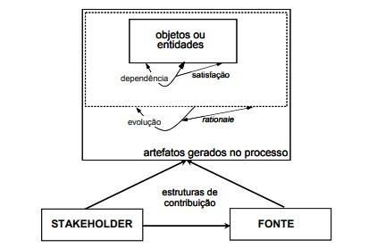

---
hide:
  - navigation
---

# Pós-rastreabilidade

## 1. Introdução

&emsp;&emsp; Rastreabilidade é um ponto importante quando falamos de elicitação de requisitos e todos os documentos e artefatos produzidos no processo considerando que estes requisitos podem mudar com o tempo, as mudanças culturais e as regras de negócios podem se alterar facilmente por isso deve-se fazer uma ligação entre os artefatos, de qual artefato eles surgiram e quais eles ajudaram a produzir. Dado o contexto, é possível fazer a rastreabilidade *forward-to*, *forward-from*, *backward-from* e *backward-to*.

* ***forward-to***: liga documentos produzidos na elicitação do plano de negócio aos requisitos relevantes que surgiram.
* ***forward-from***: liga os requisitos aos artefatos de desenho e implementação.
* ***backward-from***: liga os requisitos as suas fontes nos documentos produzidos na elicitação.
* ***backward-to***: liga os artefatos de desenho e implementação aos requisitos elencados.

&emsp;&emsp; Por exemplo, na página de [especificação suplementar](../../modelagem/4.especificacao_suplementar) é possível ver nas tabelas quais requisitos deram origem aquela especificação, assim como na página de [histórias de usuários](../../modelagem/6.historias_usuario). A rastreabilidade ainda ajuda o desenvolvimento em pontos como:

* Identificar requisitos que ainda não foram elencados;
* Resolução de requisitos em conflito;
* Estimativa de variação no cronograma do projeto;
* Verificar requisitos que não possuem casos de teste;
* Correção de defeitos;
* Validação;
* Reutilização de componentes;
* Melhorias no *hardware*(componentes físicos de uma máquina).

## 2. Metodologia

&emsp;&emsp; Para aplicar a rastreabilidade existem modelos e ferramentas que auxiliam o processo, como o metamodelo proposto por Ramesh&Jarke, o qual foca mais na simplicidade do modelo e na evolução, registrando as alterações e motivações para tal, e o metamodelo proposto por Toranzo, o qual foca mais nos aspectos gerenciais do projeto. Algumas ferramentas como softwares de ligação entre cenários e léxicos, entre requisitos e seus casos de teste existem e são oferecidos pela internet, mas para o nosso projeto optamos por algo mais simples que pudesse satisfazer facilmente nossas necessidades, como a matriz de rastreamento.

Os passos seguidos para fazer a rastreabilidade foram:

1. Definir os tipos de elos: optamos por usar o metamodelo proposto por Ramesh&Jarke;
2. Identificar as ferramentas que apoiarão: matriz de rastreamento feita em *markdown* (linguagem de apoio o qual esse site foi programado);
3. Estabelecer as entidades (artefatos, componentes, requisitos, objetos) a serem rastreados: [Rich-Picture](../../pre_rastreabilidade/RichPicture), [Perfil de usuário](../../elicitacao/1.perfil), [Personas](../../elicitacao/2.personas), [Requisitos Finais](../../elicitacao/7.requisitos%20finais), [Léxicos](../../modelagem/1.lexicos), [Cenários](../../modelagem/2.cenario), [Casos de Uso](../../modelagem/3.casos_de_uso), [Especificação Suplementar](../../modelagem/4.especificacao_suplementar), [NFR](../../modelagem/5.NFR), [Histórias de Usuário](../../modelagem/6.historias_usuario) e [Protótipo](../analise/Validacao/4.%20Protótipo.md).
4. Validar os elos com a equipe: revisão feita por um membro da equipe.

obs.: Foi considerado fazer o rastreamento do [Backlog](../../modelagem/7.backlog) nesta página, porém este artefato já traz a história de usuário e o requisito a qual ele pertence.

&emsp;&emsp; No metamodelo proposto por Ramesh&Jarke as dimensões consideradas são: **fontes**, documentos que remetem a origem dos requisitos; **interessados** (*stakeholders*), pessoas envolvidas no processo de requisitos e possuem um grau de interesse na rastreabilidade e **objetos ou artefatos**, objetos conceituais relacionados aos produtos ou artefatos gerados no desenvolvimento. E as variedades dos elos são divididas entre dois grupos: relacionados ao produto e relacionados ao processo que pode ser observado na tabela 1 e na figura 1.

<figcaption>Tabela 1: Elos do metamodelo de Ramesh&Jarke</figcaption>

| Grupo                   | Elos                        | Descrição                                                                    |
| :---------------------- | :-------------------------- | :--------------------------------------------------------------------------- |
| Relacionado ao produto  | satisfação                  | Assegurar que o requisito seja atendido pelo sistema                         |
| Relacionado ao produto  | dependência                 | Artefatos existentes que levam a novos artefatos ou artefatos modificados    |
| Relacionado ao processo | evolução                    | Representar a motivação dos artefatos que existem ou as razões para evolução |
| Relacionado ao processo | *rationale* (justificativa) | Apoiar o gerenciamento de dependência entre os artefatos                     |

<figcaption>Fonte: Alexia</figcaption>

<figcaption>Figura 1: Metamodelo de Ramesh&Jarke</figcaption>

<figcaption>Fonte: Alexia</figcaption>

&emsp;&emsp; Levando em consideração o metamodelo, os artefatos e a ferramenta escolhida, na tabela 2, 3, 4 e 5 pode ser observado o modelo de matriz a ser construída assim como exemplo para os seus campos.

<figcaption>Tabela 2: Modelo de tabela para rastreamento de artefatos</figcaption>

| Artefato     | Fontes       | Interessados   | Elo      |
| :----------- | :----------- | :------------- | :------- |
| Rich Picture | Introspecção | Alexia e Lucas | Evolução |

<figcaption>Fonte: Alexia</figcaption>

<figcaption>Tabela 3: Modelo de tabela para rastreamento *forward-from* de requisitos</figcaption>

| Id   | Requisito                  | Artefatos                                                                                                                                                                                                                                                                                                                          | Implementação           | Elo         |
| :--- | :------------------------- | :--------------------------------------------------------------------------------------------------------------------------------------------------------------------------------------------------------------------------------------------------------------------------------------------------------------------------------- | :---------------------- | :---------- |
| RF01 | Deve ser possível ver mapa | [UC01](../../modelagem/3.casos_de_uso/#31-diagrama-de-ver-mapa), [Visualizar](../../modelagem/1.lexicos/#316-visualizar), [Ver mapa](../../modelagem/2.cenario/#38-ver-mapa), [ES03](../../modelagem/4.especificacao_suplementar/#33-usabilidade), [US-01](../../modelagem/6.historias_usuario/#31-feature-1-visualizacao-do-mapa) | Completa/Parcial/Não há | Dependência |

<figcaption>Fonte: Alexia</figcaption>

<figcaption>Tabela 4: Modelo de tabela para rastreamento *backward-from* de requisitos</figcaption>

| Id   | Requisito                  | Fonte                                    |
| :--- | :------------------------- | :--------------------------------------- |
| RF01 | Deve ser possível ver mapa | [Observação](../elicitacao/3.observacao) |

<figcaption>Fonte: Alexia</figcaption>

<figcaption>Tabela 5: Modelo de tabela para rastreamento do NFR</figcaption>

| Tópico      | softgoal            | Especificação Suplementar                                           | Elo        |
| :---------- | :------------------ | :------------------------------------------------------------------ | :--------- |
| Usabilidade | Interface Intuitiva | [ES04](../../modelagem/4.especificacao_suplementar/#33-usabilidade) | Satisfação |

<figcaption>Fonte: Alexia</figcaption>

&emsp;&emsp; É importante mencionar que optamos por não separar em *backward-from* e *forward-from* como outros grupos fizeram com base nos nossos estudos e diferentes metamodelos utilizados, porém nos inspiramos em alguns detalhes como no status de implementação e em quais tabelas deveriam ser implementadas.

## 3. Matriz

&emsp;&emsp; Abaixo está a construção das tabelas completas com base nas tabelas modelos 2, 3, 4 e 5.

### 3.1. Rastreabilidade de artefatos

&emsp;&emsp; Para fazer o rastreamento dos artefatos, construímos a tabela 6 com os artefatos a técnica ou artefato que deu origem a ele (fonte) quem mais participou da sua construção e o elo deles em relação a fonte.

<figcaption>Tabela 6: Rastreamento de Artefatos</figcaption>

| Artefato                      | Fontes                                                                                  | Interessados                                                           | Elo         |
| :---------------------------- | :-------------------------------------------------------------------------------------- | :--------------------------------------------------------------------- | :---------- |
| Rich Picture                  | Introspecção                                                                            | Luíza e Alexia                                                         | Evolução    |
| Perfil de Usuário             | Questionários e Entrevista                                                              | Lucas, Luciano, Personas                                               | Evolução    |
| Persona                       | Role Playing                                                                            | Lucas e Luciano                                                        | Evolução    |
| Requisitos Finais             | Entrevista informal, Observação, Questionário, MoSCoW, Custo X Benefício, Matriz Básico | Alexia, Iago, Luíza, Marcus, Entrevistados, Usuários Finais e Personas | Satisfação  |
| Léxicos                       | Léxicos                                                                                 | Marcus, Lucas e Usuários Finais                                        | Satisfação  |
| Cenários                      | Cenários                                                                                | Lucas                                                                  | Satisfação  |
| Diagrama de Casos de Uso      | UML                                                                                     | Luiza e Luciano                                                        | Dependência |
| Especificação Suplementar     | FURPS+                                                                                  | Alexia e Iago                                                          | Rationale   |
| NFR                           | NFR Framework                                                                           | Alexia                                                                 | Rationale   |
| Histórias de Usuário          | User Stories                                                                            | Iago, Marcus e Usuários Finais                                         | Satisfação  |
| Protótipo de Baixa Fidelidade | Introspecção                                                                            | Marcus                                                                 | Satisfação  |

<figcaption>Fonte: Iago</figcaption>

### 3.2. Rastreabilidade *forward-from* de requisitos

&emsp;&emsp; Para realizar a tabela forward-from foram rastreados os requisitos da página dos Requisitos Finais ligando eles com os artefatos que foram construídos com base neles: diagramas de uso, léxicos, cenários, especificação suplementar e histórias de usuário. Como também, se o requisito foi ou não implementado e o elo que ele tem com os artefatos baseado no metamodelo de Ramesh&Jarke como pode ser visto na tabela 7.

<figcaption align='center'>Tabela 7: Rastreamento *forward-from* de requisitos</figcaption>

| Id    | Requisito                                                                                             | Artefatos                                                                                                                                                                                                                                                                                                                                                                                                                                                                                   | Implementação | Elo         |
| :---- | :---------------------------------------------------------------------------------------------------- | :------------------------------------------------------------------------------------------------------------------------------------------------------------------------------------------------------------------------------------------------------------------------------------------------------------------------------------------------------------------------------------------------------------------------------------------------------------------------------------------ | :------------ | :---------- |
| RF01  | Deve ser possível ver mapa                                                                            | [UC01](../../modelagem/3.casos_de_uso/#31-diagrama-de-ver-mapa), [Visualizar](../../modelagem/1.lexicos/#316-visualizar), [Ver mapa](../../modelagem/2.cenario/#38-ver-mapa), [ES03](../../modelagem/4.especificacao_suplementar/#33-usabilidade), [ES11](../../modelagem/4.especificacao_suplementar/#34-confiabilidade), [ES24](../../modelagem/4.especificacao_suplementar/#39-requisitos-de-interface), [US-01](../../modelagem/6.historias_usuario/#31-feature-1-visualizacao-do-mapa) | Completa      | Satisfação  |
| RF02  | Deve ser possível dar Zoom In                                                                         | [UC01](../../modelagem/3.casos_de_uso/#31-diagrama-de-ver-mapa), [Visualizar](../../modelagem/1.lexicos/#316-visualizar), [Zoom In](../../modelagem/2.cenario/#311-zoom-in), [ES03](../../modelagem/4.especificacao_suplementar/#33-usabilidade), [ES12](../../modelagem/4.especificacao_suplementar/#35-desempenho), [US-02](../../modelagem/6.historias_usuario/#31-feature-1-visualizacao-do-mapa)                                                                                       | Completa      | Dependência |
| RF03  | Deve ser possível dar Zoom Out                                                                        | [UC01](../../modelagem/3.casos_de_uso/#31-diagrama-de-ver-mapa), [Visualizar](../../modelagem/1.lexicos/#316-visualizar), [Zoom Out](../../modelagem/2.cenario/#312-zoom-out), [ES03](../../modelagem/4.especificacao_suplementar/#33-usabilidade), [US-02](../../modelagem/6.historias_usuario/#31-feature-1-visualizacao-do-mapa)                                                                                                                                                         | Completa      | Dependência |
| RF04  | Deve ser possível ver nome de ruas no mapa                                                            | [UC01](../../modelagem/3.casos_de_uso/#31-diagrama-de-ver-mapa), [Visualizar](../../modelagem/1.lexicos/#316-visualizar), [Ver nome das ruas](../../modelagem/2.cenario/#39-ver-nome-das-ruas), [US-03](../../modelagem/6.historias_usuario/#31-feature-1-visualizacao-do-mapa)                                                                                                                                                                                                             | Completa      | Dependência |
| RF05  | Deve ser possível ver localizações no mapa                                                            | [UC01](../../modelagem/3.casos_de_uso/#31-diagrama-de-ver-mapa), [Visualizar](../../modelagem/1.lexicos/#316-visualizar), [Ver localização](../../modelagem/2.cenario/#36-ver-localizacao), [ES03](../../modelagem/4.especificacao_suplementar/#33-usabilidade), [US-04](../../modelagem/6.historias_usuario/#31-feature-1-visualizacao-do-mapa)                                                                                                                                            | Completa      | Dependência |
| RF06  | Deve ser possível selecionar localizações do mapa                                                     | [UC01](../../modelagem/3.casos_de_uso/#31-diagrama-de-ver-mapa), [Visualizar](../../modelagem/1.lexicos/#316-visualizar), [Selecionar Localização](../../modelagem/2.cenario/#33-selecionar-localizacao), [ES03](../../modelagem/4.especificacao_suplementar/#33-usabilidade), [ES23](../../modelagem/4.especificacao_suplementar/#39-requisitos-de-interface), [US-05](../../modelagem/6.historias_usuario/#32-feature-2-visualizacao-de-localizacao)                                      | Completa      | Dependência |
| RF07  | Deve ser possível ver distância da localização selecionada até o usuário                              | [UC01](../../modelagem/3.casos_de_uso/#31-diagrama-de-ver-mapa), [Traçar](../../modelagem/1.lexicos/#313-tracar), [Selecionar Localização](../../modelagem/2.cenario/#33-selecionar-localizacao), [US-10](../../modelagem/6.historias_usuario/#33-feature-3-pesquisa-e-filtragem)                                                                                                                                                                                                           | Completa      | Dependência |
| RF08  | Deve ser possível ver pontos de ônibus no mapa                                                        | [UC01](../../modelagem/3.casos_de_uso/#31-diagrama-de-ver-mapa), [Visualizar](../../modelagem/1.lexicos/#316-visualizar), [Ver pontos de ônibus](../../modelagem/2.cenario/#310-ver-pontos-de-onibus), [US-27](../../modelagem/6.historias_usuario/#37-feature-7-onibus-e-metro)                                                                                                                                                                                                            | Completa      | Dependência |
| RF09  | Deve ser possível ver saídas e entradas de metrô                                                      | [UC01](../../modelagem/3.casos_de_uso/#31-diagrama-de-ver-mapa), [Visualizar](../../modelagem/1.lexicos/#316-visualizar), [Ver acessos de metrô](../../modelagem/2.cenario/#35-ver-acessos-de-metro), [US-28](../../modelagem/6.historias_usuario/#37-feature-7-onibus-e-metro)                                                                                                                                                                                                             | Completa      | Dependência |
| RF10  | Deve ser possível pesquisar por localizações                                                          | [UC02](../../modelagem/3.casos_de_uso/#32-diagrama-de-pesquisar-local), [Pesquisar](../../modelagem/1.lexicos/#311-pesquisar), [Pesquisar localizações](../../modelagem/2.cenario/#32-pesquisar-localizacoes), [ES07](../../modelagem/4.especificacao_suplementar/#34-confiabilidade), [ES23](../../modelagem/4.especificacao_suplementar/#39-requisitos-de-interface), [US-08](../../modelagem/6.historias_usuario/#33-feature-3-pesquisa-e-filtragem)                                     | Completa      | Dependência |
| RF11  | Deve ser possível ver localização destacada no mapa do local pesquisado                               | [UC02](../../modelagem/3.casos_de_uso/#32-diagrama-de-pesquisar-local), [Visualizar](../../modelagem/1.lexicos/#316-visualizar), [Pesquisar](../../modelagem/1.lexicos/#311-pesquisar), [Ver localização destacada](../../modelagem/2.cenario/#37-ver-localizacao-destacada), [ES07](../../modelagem/4.especificacao_suplementar/#34-confiabilidade), [US-09](../../modelagem/6.historias_usuario/#33-feature-3-pesquisa-e-filtragem)                                                       | Completa      | Dependência |
| RF12  | Deve ser possível ligar para a localização pesquisada caso disponível                                 | [UC02](../../modelagem/3.casos_de_uso/#32-diagrama-de-pesquisar-local), [Contato](../../modelagem/1.lexicos/#34-contato), [Ligar](../../modelagem/2.cenario/#31-ligar), [US-29](../../modelagem/6.historias_usuario/#38-feature-8-estabelecimentos)                                                                                                                                                                                                                                         | Completa      | Dependência |
| RF13  | Deve ser possível selecionar filtros de pesquisa                                                      | [UC02](../../modelagem/3.casos_de_uso/#32-diagrama-de-pesquisar-local), [Filtrar](../../modelagem/1.lexicos/#35-filtrar), [US-11](../../modelagem/6.historias_usuario/#33-feature-3-pesquisa-e-filtragem)                                                                                                                                                                                                                                                                                   | Completa      | Dependência |
| RF14  | Deve ser possível ver lista de localizações filtradas                                                 | [UC02](../../modelagem/3.casos_de_uso/#32-diagrama-de-pesquisar-local), [Filtrar](../../modelagem/1.lexicos/#35-filtrar), [Ver localização](../../modelagem/2.cenario/#36-ver-localizacao), [US-12](../../modelagem/6.historias_usuario/#33-feature-3-pesquisa-e-filtragem)                                                                                                                                                                                                                 | Completa      | Dependência |
| RF15  | Deve ser possível, caso seja restaurante, filtrar por opção de comida                                 | [Filtrar](../../modelagem/1.lexicos/#35-filtrar), [US-13](../../modelagem/6.historias_usuario/#33-feature-3-pesquisa-e-filtragem), [US-37](../../modelagem/6.historias_usuario/#310-feature-10-alimentacao)                                                                                                                                                                                                                                                                                 | Completa      | Dependência |
| RF16  | Deve ser possível, caso seja restaurante, ver cifrões para demonstrar a faixa de preço do restaurante | [Visualizar avaliações](../../modelagem/1.lexicos/#317-visualizar-avaliacoes), [US-38](../../modelagem/6.historias_usuario/#310-feature-10-alimentacao)                                                                                                                                                                                                                                                                                                                                     | Completa      | Dependência |
| RF17  | Deve ser possível ver horário de funcionamento da localização quando disponível                       | [Visualizar avaliações](../../modelagem/1.lexicos/#317-visualizar-avaliacoes), [Selecionar Localização](../../modelagem/2.cenario/#33-selecionar-localizacao), [US-06](../../modelagem/6.historias_usuario/#32-feature-2-visualizacao-de-localizacao)                                                                                                                                                                                                                                       | Completa      | Dependência |
| RF18  | Deve ser possível ver status de funcionamento da localização quando disponível                        | [Visualizar avaliações](../../modelagem/1.lexicos/#317-visualizar-avaliacoes), [Selecionar Localização](../../modelagem/2.cenario/#33-selecionar-localizacao), [US-07](../../modelagem/6.historias_usuario/#32-feature-2-visualizacao-de-localizacao)                                                                                                                                                                                                                                       | Completa      | Dependência |
| RF19  | Deve ser possível ver comentários de localizações                                                     | [Visualizar avaliações](../../modelagem/1.lexicos/#317-visualizar-avaliacoes), [Selecionar Localização](../../modelagem/2.cenario/#33-selecionar-localizacao), [US-30](../../modelagem/6.historias_usuario/#38-feature-8-estabelecimentos)                                                                                                                                                                                                                                                  | Completa      | Dependência |
| RF20  | Deve ser possível filtrar os comentários de localizações                                              | [Filtrar](../../modelagem/1.lexicos/#35-filtrar), [US-31](../../modelagem/6.historias_usuario/#38-feature-8-estabelecimentos)                                                                                                                                                                                                                                                                                                                                                               | Completa      | Dependência |
| RF21  | Deve ser possível fazer comentários sobre localizações                                                | [Avaliar](../../modelagem/1.lexicos/#33-avaliar), [US-35](../../modelagem/6.historias_usuario/#39-feature-9-contribuicao)                                                                                                                                                                                                                                                                                                                                                                   | Completa      | Dependência |
| RF22  | Deve ser possível ver nota de localizações                                                            | [Visualizar avaliações](../../modelagem/1.lexicos/#317-visualizar-avaliacoes), [Selecionar Localização](../../modelagem/2.cenario/#33-selecionar-localizacao), [US-32](../../modelagem/6.historias_usuario/#38-feature-8-estabelecimentos)                                                                                                                                                                                                                                                  | Completa      | Dependência |
| RF23  | Deve ser possível dar uma nota a uma localização                                                      | [Avaliar](../../modelagem/1.lexicos/#33-avaliar), [US-36](../../modelagem/6.historias_usuario/#39-feature-9-contribuicao)                                                                                                                                                                                                                                                                                                                                                                   | Completa      | Dependência |
| RF24  | Deve ser possível ver fotos da localização pesquisada                                                 | [Visualizar avaliações](../../modelagem/1.lexicos/#317-visualizar-avaliacoes), [Selecionar Localização](../../modelagem/2.cenario/#33-selecionar-localizacao), [US-33](../../modelagem/6.historias_usuario/#38-feature-8-estabelecimentos)                                                                                                                                                                                                                                                  | Completa      | Dependência |
| RF25  | Deve ser possível navegar no modo street view do mapa                                                 | [Visão da rua](../../modelagem/1.lexicos/#315-visao-da-rua), [US-23](../../modelagem/6.historias_usuario/#36-feature-6-vista-da-rua)                                                                                                                                                                                                                                                                                                                                                        | Completa      | Dependência |
| RF26  | Deve ser possível traçar rotas entre localizações                                                     | [UC03](../../modelagem/3.casos_de_uso/#33-diagrama-de-tracar-rota), [Traçar](../../modelagem/1.lexicos/#313-tracar), [ES01, ES02](../../modelagem/4.especificacao_suplementar/#33-usabilidade), [US-14](../../modelagem/6.historias_usuario/#34-feature-4-tracar-rotas)                                                                                                                                                                                                                     | Completa      | Dependência |
| RF27  | Deve ser possível ver distância entre localizações após traçar rota                                   | [UC03](../../modelagem/3.casos_de_uso/#33-diagrama-de-tracar-rota), [Traçar](../../modelagem/1.lexicos/#313-tracar), [Ver distância](../../modelagem/2.cenario/#34-ver-distancia), [ES01, ES02](../../modelagem/4.especificacao_suplementar/#33-usabilidade), [US-17](../../modelagem/6.historias_usuario/#34-feature-4-tracar-rotas), [US-22](../../modelagem/6.historias_usuario/#35-feature-5-navegacao)                                                                                 | Completa      | Dependência |
| RF28  | Deve ser possível selecionar meio de locomoção recomendado                                            | [UC03](../../modelagem/3.casos_de_uso/#33-diagrama-de-tracar-rota), [Meio](../../modelagem/1.lexicos/#39-meio), [Traçar](../../modelagem/1.lexicos/#313-tracar), [Ver distância](../../modelagem/2.cenario/#34-ver-distancia), [ES01, ES02](../../modelagem/4.especificacao_suplementar/#33-usabilidade), [US-15](../../modelagem/6.historias_usuario/#34-feature-4-tracar-rotas)                                                                                                           | Completa      | Dependência |
| RF29  | Deve ser possível selecionar meio de locomoção a pé                                                   | [UC03](../../modelagem/3.casos_de_uso/#33-diagrama-de-tracar-rota), [Meio](../../modelagem/1.lexicos/#39-meio), [Traçar](../../modelagem/1.lexicos/#313-tracar), [Ver distância](../../modelagem/2.cenario/#34-ver-distancia), [US-16](../../modelagem/6.historias_usuario/#34-feature-4-tracar-rotas)                                                                                                                                                                                      | Completa      | Dependência |
| RF30  | Deve ser possível selecionar meio de locomoção de carro                                               | [UC03](../../modelagem/3.casos_de_uso/#33-diagrama-de-tracar-rota), [Meio](../../modelagem/1.lexicos/#39-meio), [Traçar](../../modelagem/1.lexicos/#313-tracar), [Ver distância](../../modelagem/2.cenario/#34-ver-distancia), [US-16](../../modelagem/6.historias_usuario/#34-feature-4-tracar-rotas)                                                                                                                                                                                      | Completa      | Dependência |
| RF31  | Deve ser possível selecionar meio de locomoção bicicleta                                              | [UC03](../../modelagem/3.casos_de_uso/#33-diagrama-de-tracar-rota), [Meio](../../modelagem/1.lexicos/#39-meio), [Traçar](../../modelagem/1.lexicos/#313-tracar), [Ver distância](../../modelagem/2.cenario/#34-ver-distancia), [US-16](../../modelagem/6.historias_usuario/#34-feature-4-tracar-rotas)                                                                                                                                                                                      | Completa      | Dependência |
| RF32  | Deve ser possível selecionar meio de locomoção voos quando disponível                                 | [UC03](../../modelagem/3.casos_de_uso/#33-diagrama-de-tracar-rota), [Meio](../../modelagem/1.lexicos/#39-meio), [Traçar](../../modelagem/1.lexicos/#313-tracar), [Ver distância](../../modelagem/2.cenario/#34-ver-distancia), [US-16](../../modelagem/6.historias_usuario/#34-feature-4-tracar-rotas)                                                                                                                                                                                      | Não há        | Evolução    |
| RF33  | Deve ser possível após traçar rota ver horário de deslocamento                                        | [UC03](../../modelagem/3.casos_de_uso/#33-diagrama-de-tracar-rota), [US-18](../../modelagem/6.historias_usuario/#34-feature-4-tracar-rotas)                                                                                                                                                                                                                                                                                                                                                 | Completa      | Dependência |
| RF34  | Deve ser possível, caso selecionado ônibus para a rota, ver linhas disponíveis                        | [Linhas](../../modelagem/1.lexicos/#38-linhas), [Traçar](../../modelagem/1.lexicos/#313-tracar), [US-24](../../modelagem/6.historias_usuario/#37-feature-7-onibus-e-metro)                                                                                                                                                                                                                                                                                                                  | Completa      | Dependência |
| RF35  | Deve ser possível, caso selecionado ônibus para a rota, ver próximo horário de saída                  | [Horário de saída](../../modelagem/1.lexicos/#36-horario-de-saida), [US-25](../../modelagem/6.historias_usuario/#37-feature-7-onibus-e-metro)                                                                                                                                                                                                                                                                                                                                               | Completa      | Dependência |
| RF36  | Deve ser possível, caso selecionado ônibus para a rota, ver preço da passagem                         | [Passagem](../../modelagem/1.lexicos/#310-passagem), [US-26](../../modelagem/6.historias_usuario/#37-feature-7-onibus-e-metro)                                                                                                                                                                                                                                                                                                                                                              | Completa      | Dependência |
| RF37  | Deve ser possível iniciar rota e acompanhamento pelo mapa                                             | [Iniciar](../../modelagem/1.lexicos/#37-iniciar), [US-19](../../modelagem/6.historias_usuario/#35-feature-5-navegacao)                                                                                                                                                                                                                                                                                                                                                                      | Completa      | Dependência |
| RF38  | Deve ser possível escutar comandos de voz após rota iniciada                                          | [Acompanhamento por voz](../../modelagem/1.lexicos/#32-acompanhamento-por-voz), [US-20](../../modelagem/6.historias_usuario/#35-feature-5-navegacao)                                                                                                                                                                                                                                                                                                                                        | Completa      | Dependência |
| RF39  | Deve ser possível, caso a localização seja perigosa, um aviso deve aparecer para o usuário            | [US-21](../../modelagem/6.historias_usuario/#35-feature-5-navegacao)                                                                                                                                                                                                                                                                                                                                                                                                                        | Completa      | Dependência |
| RF40  | Deve ser possível criar a localização de estabelecimentos no mapa                                     | [US-34](../../modelagem/6.historias_usuario/#39-feature-9-contribuicao)                                                                                                                                                                                                                                                                                                                                                                                                                     | Completa      | Dependência |
| RF41  | Deve ser possível encontrar localizações que permitem acesso a animais de estimação                   | [Filtrar](../../modelagem/1.lexicos/#35-filtrar)                                                                                                                                                                                                                                                                                                                                                                                                                                            | Completa      | Dependência |
| RF42  | Deve ser possível encontrar localizações acessíveis a cadeirantes                                     | [Filtrar](../../modelagem/1.lexicos/#35-filtrar)                                                                                                                                                                                                                                                                                                                                                                                                                                            | Completa      | Dependência |
| RF43  | Deve ser possível encontrar localizações acessíveis a pessoas com deficiência auditiva                | [Filtrar](../../modelagem/1.lexicos/#35-filtrar)                                                                                                                                                                                                                                                                                                                                                                                                                                            | Completa      | Dependência |
| RF44  | Deve ser possível encontrar localizações acessíveis a pessoas com deficiência visual                  | [Filtrar](../../modelagem/1.lexicos/#35-filtrar)                                                                                                                                                                                                                                                                                                                                                                                                                                            | Completa      | Dependência |
| RF45  | Deve ser possível obter informações acerca de obstruções no caminho                                   |                                                                                                                                                                                                                                                                                                                                                                                                                                                                                             | Completa      |             |
| RF46  | Deve ser possível obter informações acerca de acidentes no caminho                                    |                                                                                                                                                                                                                                                                                                                                                                                                                                                                                             | Completa      |             |
| RF47  | Deve ser possível obter informações acerca de obras no caminho                                        |                                                                                                                                                                                                                                                                                                                                                                                                                                                                                             | Completa      |             |
| RF48  | Deve ser possível obter informações acerca de radares no caminho                                      | [Acompanhamento por voz](../../modelagem/1.lexicos/#32-acompanhamento-por-voz), [Segundo plano](../../modelagem/1.lexicos/#312-segundo-plano)                                                                                                                                                                                                                                                                                                                                               | Completa      | Dependência |
| RF49  | Deve ser possível obter informações acerca de congestionamentos no caminho                            |                                                                                                                                                                                                                                                                                                                                                                                                                                                                                             | Completa      | Dependência |
| RF50  | Deve ser possível saber valores e horários acerca de transportes públicos                             | [Passagem](../../modelagem/1.lexicos/#310-passagem)                                                                                                                                                                                                                                                                                                                                                                                                                                         | Completa      | Dependência |
| RF51  | Deve ser possível fixar e desafixar localizações como favoritas                                       |                                                                                                                                                                                                                                                                                                                                                                                                                                                                                             | Completa      |             |
| RF52  | Deve ser possível ver localizações fixadas como favoritas                                             |                                                                                                                                                                                                                                                                                                                                                                                                                                                                                             | Completa      |             |
| RF53  | Deve ser possível compartilhar localizações                                                           |                                                                                                                                                                                                                                                                                                                                                                                                                                                                                             | Completa      |             |
| RF54  | Deve ser possível compartilhar rotas                                                                  |                                                                                                                                                                                                                                                                                                                                                                                                                                                                                             | Completa      |             |
| RF55  | Deve ser possível compartilhar comentários sobre localizações                                         | [Visualizar avaliações](../../modelagem/1.lexicos/#317-visualizar-avaliacoes)                                                                                                                                                                                                                                                                                                                                                                                                               | Completa      | Dependência |
| RF56  | Deve ser possível compartilhar fotos de localizações                                                  | [Visualizar avaliações](../../modelagem/1.lexicos/#317-visualizar-avaliacoes)                                                                                                                                                                                                                                                                                                                                                                                                               | Completa      | Dependência |
| RF57  | Deve ser possível definir localização de casa                                                         |                                                                                                                                                                                                                                                                                                                                                                                                                                                                                             | Completa      |             |
| RF58  | Deve ser possível definir localização de trabalho                                                     |                                                                                                                                                                                                                                                                                                                                                                                                                                                                                             | Completa      |             |
| RF59  | Deve ser possível definir localização de estabelecimentos frequentados                                | [Segundo plano](../../modelagem/1.lexicos/#312-segundo-plano)                                                                                                                                                                                                                                                                                                                                                                                                                               | Completa      | Dependência |
| RNF01 | As rotas devem ser traçadas de acordo com as políticas de trânsito de cada cidade                     | [ES06](../../modelagem/4.especificacao_suplementar/#33-usabilidade)                                                                                                                                                                                                                                                                                                                                                                                                                         | Completa      | Dependência |
| RNF02 | Devem ser traçadas áreas de alerta de acordo com o perigo de cada região                              | [ES10](../../modelagem/4.especificacao_suplementar/#34-confiabilidade)                                                                                                                                                                                                                                                                                                                                                                                                                      | Completa      | Dependência |
| RNF03 | O aplicativo deve funcionar 24h por dia                                                               | [Acessar](../../modelagem/1.lexicos/#31-acessar), [ES08](../../modelagem/4.especificacao_suplementar/#34-confiabilidade), [ES13](../../modelagem/4.especificacao_suplementar/#35-desempenho), [ES24](../../modelagem/4.especificacao_suplementar/#39-requisitos-de-interface)                                                                                                                                                                                                               | Completa      | Dependência |
| RNF04 | O aplicativo deve estar disponível tanto para Android como IOS                                        | [Acessar](../../modelagem/1.lexicos/#31-acessar), [ES15, ES16, ES17](../../modelagem/4.especificacao_suplementar/#36-suportabilidade), [ES18, ES19, ES20](../../modelagem/4.especificacao_suplementar/#37-restricoes-de-design)                                                                                                                                                                                                                                                             | Completa      | Dependência |
| RNF05 | Deve ser possível utilizar o aplicativo sem internet                                                  | [Acessar](../../modelagem/1.lexicos/#31-acessar), [ES09](../../modelagem/4.especificacao_suplementar/#34-confiabilidade)                                                                                                                                                                                                                                                                                                                                                                    | Completa      | Dependência |
| RNF06 | O aplicativo deve ser acessível para pessoas com deficiência auditiva                                 | [Acessar](../../modelagem/1.lexicos/#31-visualizar), [Ver localização destacada](../../modelagem/2.cenario/#37-ver-localizacao-destacada)                                                                                                                                                                                                                                                                                                                                                   | Não há        | Satisfação  |
| RNF07 | O aplicativo deve ser acessível para pessoas com deficiência visual                                   | [Acessar](../../modelagem/1.lexicos/#31-acessar), [Acompanhamento por voz](../../modelagem/1.lexicos/#32-acompanhamento-por-voz), [Segundo plano](../../modelagem/1.lexicos/#312-segundo-plano)                                                                                                                                                                                                                                                                                             | Não há        | Satisfação  |

<figcaption align='center'>Fonte: Alexia</figcaption>

### 3.3. Rastreabilidade *backward-from* de requisitos

&emsp;&emsp; A tabela 8 apresenta os requisitos e a técnica que deu origem a eles assim como o elo entre a fonte e o requisito.

<figcaption>Tabela 8: Matriz de rastreabilidade backward-from</figcaption>

| Id    | Requisito                                                                                             | Fonte                                                                                                                                                  |
| :---- | :---------------------------------------------------------------------------------------------------- | :----------------------------------------------------------------------------------------------------------------------------------------------------- |
| RF01  | Deve ser possível ver mapa                                                                            | [Observação](../elicitacao/3.observacao.md)                                                                                                            |
| RF02  | Deve ser possível dar Zoom In                                                                         | [Observação](../elicitacao/3.observacao.md)                                                                                                            |
| RF03  | Deve ser possível dar Zoom Out                                                                        | [Observação](../elicitacao/3.observacao.md)                                                                                                            |
| RF04  | Deve ser possível ver nome de ruas no mapa                                                            | [Observação](../elicitacao/3.observacao.md) e [Questionário](../elicitacao/5.questionario.md)                                                          |
| RF05  | Deve ser possível ver localizações no mapa                                                            | [Observação](../elicitacao/3.observacao.md)                                                                                                            |
| RF06  | Deve ser possível selecionar localizações do mapa                                                     | [Observação](../elicitacao/3.observacao.md)                                                                                                            |
| RF07  | Deve ser possível ver distância da localização selecionada até o usuário                              | [Observação](../elicitacao/3.observacao.md) e [Questionário](../elicitacao/5.questionario.md)                                                          |
| RF08  | Deve ser possível ver pontos de ônibus no mapa                                                        | [Observação](../elicitacao/3.observacao.md)                                                                                                            |
| RF09  | Deve ser possível ver saídas e entradas de metrô                                                      | [Observação](../elicitacao/3.observacao.md)                                                                                                            |
| RF10  | Deve ser possível pesquisar por localizações                                                          | [Observação](../elicitacao/3.observacao.md) e [Questionário](../elicitacao/5.questionario.md)                                                          |
| RF11  | Deve ser possível ver localização destacada no mapa do local pesquisado                               | [Observação](../elicitacao/3.observacao.md)                                                                                                            |
| RF12  | Deve ser possível ligar para a localização pesquisada caso disponível                                 | [Observação](../elicitacao/3.observacao.md)                                                                                                            |
| RF13  | Deve ser possível selecionar filtros de pesquisa                                                      | [Observação](../elicitacao/3.observacao.md)                                                                                                            |
| RF14  | Deve ser possível ver lista de localizações filtradas                                                 | [Observação](../elicitacao/3.observacao.md)                                                                                                            |
| RF15  | Deve ser possível, caso seja restaurante, filtrar por opção de comida                                 | [Observação](../elicitacao/3.observacao.md)                                                                                                            |
| RF16  | Deve ser possível, caso seja restaurante, ver cifrões para demonstrar a faixa de preço do restaurante | [Observação](../elicitacao/3.observacao.md)                                                                                                            |
| RF17  | Deve ser possível ver horário de funcionamento da localização quando disponível                       | [Observação](../elicitacao/3.observacao.md)                                                                                                            |
| RF18  | Deve ser possível ver status de funcionamento da localização quando disponível                        | [Observação](../elicitacao/3.observacao.md)                                                                                                            |
| RF19  | Deve ser possível ver comentários de localizações                                                     | [Observação](../elicitacao/3.observacao.md) e [Questionário](../elicitacao/5.questionario.md)                                                          |
| RF20  | Deve ser possível filtrar os comentários de localizações                                              | [Observação](../elicitacao/3.observacao.md) e [Questionário](../elicitacao/5.questionario.md)                                                          |
| RF21  | Deve ser possível fazer comentários sobre localizações                                                | [Observação](../elicitacao/3.observacao.md) e [Questionário](../elicitacao/5.questionario.md)                                                          |
| RF22  | Deve ser possível ver nota de localizações                                                            | [Observação](../elicitacao/3.observacao.md) e [Questionário](../elicitacao/5.questionario.md)                                                          |
| RF23  | Deve ser possível dar uma nota a uma localização                                                      | [Observação](../elicitacao/3.observacao.md) e [Questionário](../elicitacao/5.questionario.md)                                                          |
| RF24  | Deve ser possível ver fotos da localização pesquisada                                                 | [Observação](../elicitacao/3.observacao.md)                                                                                                            |
| RF25  | Deve ser possível navegar no modo Street View do mapa                                                 | [Observação](../elicitacao/3.observacao.md) e [Questionário](../elicitacao/5.questionario.md)                                                          |
| RF26  | Deve ser possível traçar rotas entre localizações                                                     | [Observação](../elicitacao/3.observacao.md) e [Questionário](../elicitacao/5.questionario.md)                                                          |
| RF27  | Deve ser possível ver distância entre localizações após traçar rota                                   | [Observação](../elicitacao/3.observacao.md), [Entrevista](../elicitacao/4.entrevista.md) e [Questionário](../elicitacao/5.questionario.md)             |
| RF28  | Deve ser possível selecionar meio de locomoção recomendado                                            | [Observação](../elicitacao/3.observacao.md)                                                                                                            |
| RF29  | Deve ser possível selecionar meio de locomoção a pé                                                   | [Observação](../elicitacao/3.observacao.md)                                                                                                            |
| RF30  | Deve ser possível selecionar meio de locomoção de carro                                               | [Observação](../elicitacao/3.observacao.md)                                                                                                            |
| RF31  | Deve ser possível selecionar meio de locomoção bicicleta                                              | [Observação](../elicitacao/3.observacao.md)                                                                                                            |
| RF32  | Deve ser possível selecionar meio de locomoção voos quando disponível                                 | [Observação](../elicitacao/3.observacao.md)                                                                                                            |
| RF33  | Deve ser possível após traçar rota ver horário de deslocamento                                        | [Observação](../elicitacao/3.observacao.md)                                                                                                            |
| RF34  | Deve ser possível, caso selecionado ônibus para a rota, ver linhas disponíveis                        | [Observação](../elicitacao/3.observacao.md)                                                                                                            |
| RF35  | Deve ser possível, caso selecionado ônibus para a rota, ver próximo horário de saída                  | [Observação](../elicitacao/3.observacao.md)                                                                                                            |
| RF36  | Deve ser possível, caso selecionado ônibus para a rota, ver preço da passagem                         | [Observação](../elicitacao/3.observacao.md)                                                                                                            |
| RF37  | Deve ser possível iniciar rota e acompanhamento pelo mapa                                             | [Observação](../elicitacao/3.observacao.md) e [Entrevista](../elicitacao/4.entrevista.md)                                                              |
| RF38  | Deve ser possível escutar comandos de voz após rota iniciada                                          | [Observação](../elicitacao/3.observacao.md)                                                                                                            |
| RF39  | Deve ser possível, caso a localização seja perigosa, um aviso deve aparecer para o usuário            | [Observação](../elicitacao/3.observacao.md)                                                                                                            |
| RF40  | Deve ser possível criar a localização de estabelecimentos no mapa                                     | [Homologação](../analise/Validacao/3.%20Homologação.md)                                                                                                |
| RF41  | Deve ser possível encontrar localizações que permitem acesso a animais de estimação                   | [Homologação](../analise/Validacao/3.%20Homologação.md)                                                                                                |
| RF42  | Deve ser possível encontrar localizações acessíveis a cadeirantes                                     | [Homologação](../analise/Validacao/3.%20Homologação.md)                                                                                                |
| RF43  | Deve ser possível encontrar localizações acessíveis a pessoas com deficiência auditiva                | [Homologação](../analise/Validacao/3.%20Homologação.md)                                                                                                |
| RF44  | Deve ser possível encontrar localizações acessíveis a pessoas com deficiência visual                  | [Homologação](../analise/Validacao/3.%20Homologação.md)                                                                                                |
| RF45  | Deve ser possível obter informações acerca de obstruções no caminho                                   | [Entrevista](../elicitacao/4.entrevista.md) e [Homologação](../analise/Validacao/3.%20Homologação.md)                                                  |
| RF46  | Deve ser possível obter informações acerca de acidentes no caminho                                    | [Entrevista](../elicitacao/4.entrevista.md) e [Homologação](../analise/Validacao/3.%20Homologação.md)                                                  |
| RF47  | Deve ser possível obter informações acerca de obras no caminho                                        | [Homologação](../analise/Validacao/3.%20Homologação.md)                                                                                                |
| RF48  | Deve ser possível obter informações acerca de radares no caminho                                      | [Entrevista](../elicitacao/4.entrevista.md), [Questionário](../elicitacao/5.questionario.md) e [Homologação](../analise/Validacao/3.%20Homologação.md) |
| RF49  | Deve ser possível obter informações acerca de congestionamentos no caminho                            | [Entrevista](../elicitacao/4.entrevista.md)                                                                                                            |
| RF50  | Deve ser possível saber valores e horários acerca de transportes públicos                             | [Homologação](../analise/Validacao/3.%20Homologação.md)                                                                                                |
| RF51  | Deve ser possível fixar e desafixar localizações como favoritas                                       | [Questionário](../elicitacao/5.questionario.md)                                                                                                        |
| RF52  | Deve ser possível ver localizações fixadas como favoritas                                             | [Questionário](../elicitacao/5.questionario.md)                                                                                                        |
| RF53  | Deve ser possível compartilhar localizações                                                           | [Requisitos Finais](../elicitacao/7.requisitos%20finais.md)                                                                                            |
| RF54  | Deve ser possível compartilhar rotas                                                                  | [Requisitos Finais](../elicitacao/7.requisitos%20finais.md)                                                                                            |
| RF55  | Deve ser possível compartilhar comentários sobre localizações                                         | [Requisitos Finais](../elicitacao/7.requisitos%20finais.md)                                                                                            |
| RF56  | Deve ser possível compartilhar fotos de localizações                                                  | [Requisitos Finais](../elicitacao/7.requisitos%20finais.md)                                                                                            |
| RF57  | Deve ser possível definir localização de casa                                                         | [Requisitos Finais](../elicitacao/7.requisitos%20finais.md)                                                                                            |
| RF58  | Deve ser possível definir localização de trabalho                                                     | [Requisitos Finais](../elicitacao/7.requisitos%20finais.md)                                                                                            |
| RF59  | Deve ser possível definir localização de estabelecimentos frequentados                                | [Requisitos Finais](../elicitacao/7.requisitos%20finais.md)                                                                                            |
| RF60  | Deve ser possível ver informações sobre um estabelecimento                                            | [Entrevista](../elicitacao/4.entrevista.md) e [Questionário](../elicitacao/5.questionario.md)                                                          |
| RNF01 | As rotas devem ser traçadas de acordo com as políticas de trânsito de cada cidade                     | [Observação](../elicitacao/3.observacao.md) e [Questionário](../elicitacao/5.questionario.md)                                                          |
| RNF02 | Devem ser traçadas áreas de alerta de acordo com o perigo de cada região                              | [Observação](../elicitacao/3.observacao.md)                                                                                                            |
| RNF03 | O aplicativo deve funcionar 24h por dia                                                               | [Observação](../elicitacao/3.observacao.md)                                                                                                            |
| RNF04 | O aplicativo deve estar disponível tanto para Android como IOS                                        | [Observação](../elicitacao/3.observacao.md)                                                                                                            |
| RNF05 | Deve ser possível utilizar o aplicativo sem internet                                                  | [Homologação](../analise/Validacao/3.%20Homologação.md)                                                                                                |
| RNF06 | O aplicativo deve ser acessível para pessoas com deficiência auditiva                                 | [Homologação](../analise/Validacao/3.%20Homologação.md)                                                                                                |
| RNF07 | O aplicativo deve ser acessível para pessoas com deficiência visual                                   | [Entrevista](../elicitacao/4.entrevista.md) e [Homologação](../analise/Validacao/3.%20Homologação.md)                                                  |
| RNF08 | O aplicativo deve ter um sistema de proteção às informações pessoais do usuário                       | [Observação](../elicitacao/3.observacao.md) e [Homologação](../analise/Validacao/3.%20Homologação.md)                                                  |

<figcaption>Fonte: Iago</figcaption>

### 3.4. Rastreabilidade do NFR

&emsp;&emsp;A tabela 9 abaixo mostra o rastreamento das especificações que foram feitas relacionadas com os softgoals usados dentro do projeto:

<figcaption>Tabela 9: Tabela para rastreamento do NFR</figcaption>

| Tópico          | softgoal                                                           | Especificação Suplementar                                                                                                                 | Elo         |
| :-------------- | :----------------------------------------------------------------- | :---------------------------------------------------------------------------------------------------------------------------------------- | :---------- |
| Usabilidade     | Interface Intuitiva                                                | [ES06](../../modelagem/4.especificacao_suplementar/#33-usabilidade)                                                                       | Satisfação  |
| Usabilidade     | Cores intuitivas                                                   | [ES05](../../modelagem/4.especificacao_suplementar/#33-usabilidade)                                                                       | Satisfação  |
| Usabilidade     | Ícones e descrições intuitivas                                     | [ES04](../../modelagem/4.especificacao_suplementar/#33-usabilidade)                                                                       | Satisfação  |
| Usabilidade     | Fácil de aprender a usar                                           | [ES02](../../modelagem/4.especificacao_suplementar/#33-usabilidade) e [ES03](../../modelagem/4.especificacao_suplementar/#33-usabilidade) | Satisfação  |
| Usabilidade     | Caminhos curtos para funcionalidades                               | [ES01](../../modelagem/4.especificacao_suplementar/#33-usabilidade)                                                                       | Satisfação  |
| Confiabilidade  | Áreas de alerta                                                    | [ES11](../../modelagem/4.especificacao_suplementar/#34-confiabilidade)                                                                    | Evolução    |
| Confiabilidade  | Pouca margem de erro de localização                                | [ES07](../../modelagem/4.especificacao_suplementar/#34-confiabilidade)                                                                    | Dependência |
| Confiabilidade  | Sistema de funcionar 24h, 7 dias por semana                        | [ES08](../../modelagem/4.especificacao_suplementar/#34-confiabilidade)                                                                    | Satisfação  |
| Confiabilidade  | Proteção de dados                                                  | [ES26](../../modelagem/4.especificacao_suplementar/#34-confiabilidade)                                                                    | Satisfação  |
| Confiabilidade  | Caminho das rotas de acordo com as políticas de trânsito da região | [ES10](../../modelagem/4.especificacao_suplementar/#34-confiabilidade)                                                                    | Satisfação  |
| Desempenho      | Tempo de resposta rápido                                           | [ES12](../../modelagem/4.especificacao_suplementar/#35-desempenho)                                                                        | Satisfação  |
| Desempenho      | Opção do aplicativo pelo navegador                                 | [ES13](../../modelagem/4.especificacao_suplementar/#35-desempenho)                                                                        | Evolução    |
| Desempenho      | Suportar milhões de usuário                                        | [ES14](../../modelagem/4.especificacao_suplementar/#35-desempenho)                                                                        | Satisfação  |
| Suportabilidade | Visualização em tela horizontal e vertical                         | [ES15](../../modelagem/4.especificacao_suplementar/#36-suportabilidade)                                                                   | Satisfação  |
| Suportabilidade | Linguagem de programação compatível                                | [ES16](../../modelagem/4.especificacao_suplementar/#36-suportabilidade)                                                                   | Satisfação  |
| Suportabilidade | Todas as funcionalidades funcionando para diferentes sistemas      | [ES17](../../modelagem/4.especificacao_suplementar/#36-suportabilidade)                                                                   | Satisfação  |

<figcaption>Fonte: Luíza</figcaption>

## 4. Histórico de versão

| Data       | Versão | Modificações                                  | Autor(es)     | Revisor(es) |
| ---------- | ------ | --------------------------------------------- | ------------- | ----------- |
| 24/01/2023 | 1.0    | Criação página com introdução e metodologia   | Alexia        | Iago        |
| 25/01/2023 | 1.1    | Adição da tabela de rastreabilidade do NFR    | Luíza         | Alexia      |
| 27/01/2023 | 1.2    | Correções na tabela de rastreabilidade do NFR | Luíza         | Alexia      |
| 29/01/2023 | 1.3    | Adição da tabela de backward-from             | Iago          | Luciano     |
| 29/01/2023 | 1.4    | Adição da tabela de artefatos                 | Iago          | Luciano     |
| 31/01/2023 | 1.5    | Correções artefato                            | Alexia e Iago | Luciano     |
| 01/02/2023 | 1.6    | Adiciona link para o protótipo                | Alexia e Iago | Luciano     |

## 5. Bibliografia

> SERRANO, Milene; SERRANO, Maurício. Requisitos - Aula 26. Brasília: Unb-Gama, 2017. 44 slides, color. Disponível em: [link](https://aprender3.unb.br/pluginfile.php/2307580/mod_resource/content/1/Requisitos%20-%20Aula%20026.pdf). Acesso em: 24 jan. 2023.

> SAYÃO, M; LEITE, J. Rastreabilidade de Requisitos. Departamento de Informática, Pontifícia Universidade Católica do Rio de Janeiro. Rio de Janeiro. 2005.  Disponível em: [link](https://aprender3.unb.br/pluginfile.php/2307584/mod_resource/content/3/05_20_sayao.pdf). Acesso em: 24 jan. 2023.
